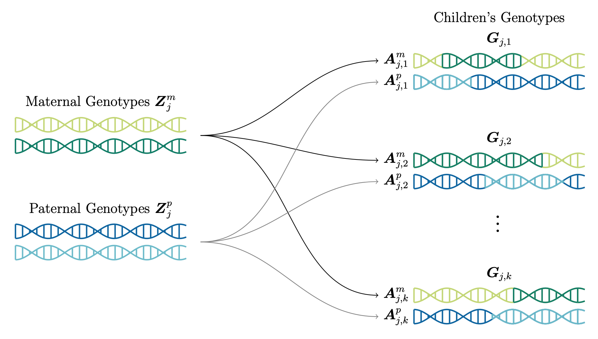
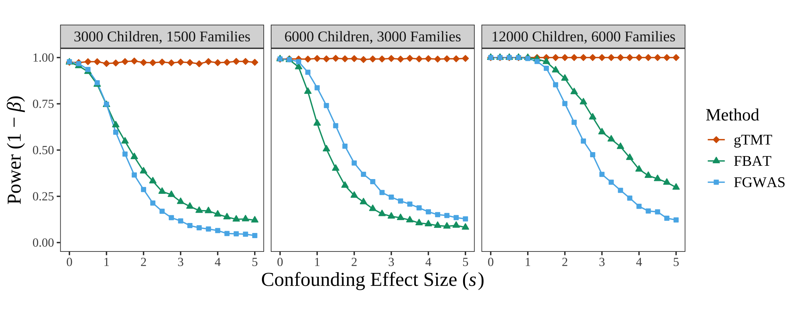
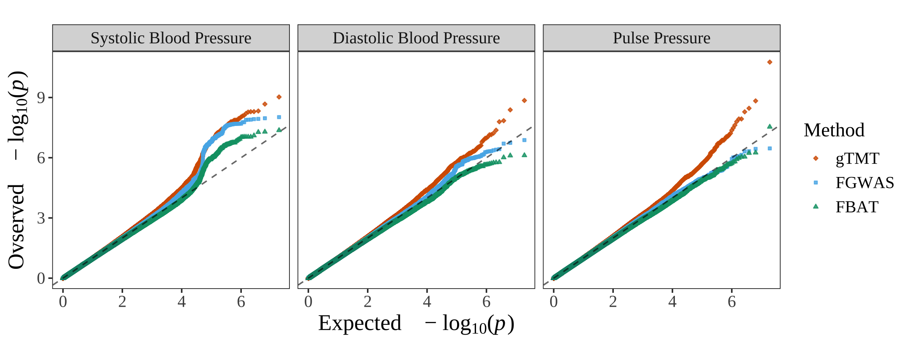

\newcommand{\tmt}{\text{TMT}}
\newcommand{\gtmt}{\text{GTMT}}
\newcommand{\E}{\mathbb{E}}
\newcommand{\V}{\mathbb{V}}
\newcommand{\pp}{\mathbb{P}}
\newcommand{\cC}{\mathcal{C}}
\newcommand{\cV}{\mathbb{C}}
\newcommand{\cT}{\mathcal{T}}
\newcommand{\cH}{\mathcal{H}}
\newcommand{\indicator}{\mathcal{I}}

# Introduction

This document serves as a reproducible record supporting our manuscript, "*A generalized test of genotype-phenotype causality in population-sampled nuclear families*". Corresponding web resources can be found in this repository (https://github.com/StoreyLab/causal-nuclear-family).

# Packages

## Main package

The source code and documentation for the main R package `geneticTMT` are available at https://github.com/StoreyLab/geneticTMT.

```{r install_main_package, echo=TRUE, eval=FALSE}
install.packages("devtools")
devtools::install_github("StoreyLab/geneticTMT")
```


## Load pacakges

```{r library, echo=TRUE, eval=TRUE, results='hide', message=FALSE, warning=FALSE}
library(ggplot2)       # for generating plots
library(plyr)          # for highlighting categories
library(latex2exp)     # for plot text latex
library(cowplot)       # for merging plots
library(gridExtra)     # for griding plots
library(grid)          # for griding plots
library(bnpsd)         # for simulating genotype
library(reshape2)      # for transforming data format
library(knitr)         # for table output
library(parallel)      # for parallele computing
library(PRROC)         # for calculating auroc
library(showtext)      # for changing fonts
library(geneticTMT)    # the main package
```

Also import utility functions for this reproducible work.

```{r utility_functions, echo=TRUE, eval=TRUE, results='hide'}
in_path_package = "../R/utilities" # set path to your downloaded source code
sapply(list.files(pattern="[.]R$", 
                  path=in_path_package, full.names=TRUE), source)
```

# Nuclear family data

## Parental genotypes

```{r simulate_fam_data, echo=TRUE, eval=FALSE, results='hide'}
# simulate parental genotypes from an admixed population
k_pop <- 4 # the number of intermediate subpopuations
K_j <- c(1,2,3) # the number of offspring per family
n_fam <- c(1000,1000,1000) # the total number of families
n_ind <- sum(K_j * n_fam) # the total number of offspring
m_snp <- 100000 # the number of SNPs per individual
c_snp <- 100 # the number of direct causal SNPs
param_fam <- sim_geno_param(m=m_snp, n=sum(n_fam), k=k_pop, Fst=0.2)
# simulate maternal genotype
zm <- sim_geno(p_s=param_fam$p_s, q=param_fam$q)
# generate paternal genotype
zp <- sim_geno(p_s=param_fam$p_s, q=param_fam$q)
```

## Offspring genotypes

```{r simulate_child_geno, echo=TRUE, eval=FALSE, results='hide'}
# families with the same number of children 
geno_m_1 <- zm[,which(n_sib==K_j[1])] # mother with one offspring
geno_m_2 <- zm[,which(n_sib==K_j[2])] # mother with two offspring
geno_m_3 <- zm[,which(n_sib==K_j[3])] # mother with three offspring
geno_p_1 <- zp[,which(n_sib==K_j[1])] # father with one offspring
geno_p_2 <- zp[,which(n_sib==K_j[2])] # father with two offspring
geno_p_3 <- zp[,which(n_sib==K_j[3])] # father with three offspring
# meiosis id 
id_fam_1 <- rep(c(1:n_fam[1]), K_j[1])
id_fam_2 <- rep(c(1:n_fam[2]), K_j[2])
id_fam_3 <- rep(c(1:n_fam[3]), K_j[3])
# tidy according to family id
geno_m_1 <- geno_m_1[,id_fam_1]
geno_m_2 <- geno_m_2[,id_fam_2]
geno_m_3 <- geno_m_3[,id_fam_3]
geno_p_1 <- geno_p_1[,id_fam_1]
geno_p_2 <- geno_p_2[,id_fam_2]
geno_p_3 <- geno_p_3[,id_fam_3]
# offspring genotypes ########################################################
# simulate maternal alleles
allele_m_1 <- sim_allele(geno_m_1)
allele_m_2 <- sim_allele(geno_m_2)
allele_m_3 <- sim_allele(geno_m_3)
# generate paternal alleles
allele_p_1 <- sim_allele(geno_p_1)
allele_p_2 <- sim_allele(geno_p_2)
allele_p_3 <- sim_allele(geno_p_3)
# generate offspring genotypes
g_1 <- allele_m_1 + allele_p_1
g_2 <- allele_m_2 + allele_p_2
g_3 <- allele_m_3 + allele_p_3
```


## Offspring phenotype

We first generated a non-genetic factor associated with the population structure. Let $\boldsymbol{E}=\{E_j\}$ be the random non-genetic factor. We adopted the admixture proportion $\boldsymbol{q}=\{q_{ju}\}$ to simulate $E_j$ as $$\begin{aligned}
E_j &= \sum_{u=1}^U q_{ju}R_u,\quad R_u \sim \mathcal{N}(u,1) \text{ for }u \in [1:U], \quad U=4.
\end{aligned}$$ Let $\mathcal{C}$ be the loci indices set for all causal SNPs, $\mathcal{I}(\cdot)$ the indicator function. We simulate the offspring phenotype $\boldsymbol{Y}=\{Y_{j,k}\}$ as $$\begin{aligned} 
Y_{j,k} &= \iota + \sum_{i\in \mathcal{C}}\Big( \alpha_0\mathcal{I}(G_{i,j,k}=0) + \alpha_1\mathcal{I}(G_{i,j,k}=1) + \alpha_2\mathcal{I}(G_{i,j,k}=2) \Big)+\beta E_j+\epsilon_{j,k}.
\end{aligned}$$ We considered the following parameters $$\alpha_0=\beta, \alpha_1=2\beta, \alpha_2=3\beta.$$
Then the ratio $(\alpha_2-\alpha_1)/(\alpha_1-\alpha_0)$ is 1. Given the desired heritability $h^2=\sigma_a^2/(\sigma_a^2+\sigma_e^2)$ where we set $\sigma_e^2=1$, we simulated $\beta$ such that $\sigma^2_a=\V\Big(\iota +\sum_{i\in \mathcal{C}}\alpha_0 \mathcal{I}(G_{i,j,k}=0) + \sum_{i\in \mathcal{C}}\alpha_1 \mathcal{I}(G_{i,j,k}=1) + \sum_{i\in \mathcal{C}}\alpha_2\mathcal{I}(G_{i,j,k}=2)\Big)$, achieving the desired $h^2$. See @sec-gTMT for implementing these simulations. 

## Figure S1

The LaTeX source code for Figure S1 is available [here](https://github.com/StoreyLab/causal-nuclear-family/manuscript/figures).




# The generalized TMT (gTMT)

## Figure 1

The LaTeX source code for Figure 1 is available [here](https://github.com/StoreyLab/causal-nuclear-family/manuscript/figures).

![Figure 1: Schematic of the gTMT randomization framework. For offspring $k$ in family $j$, if a heterozygous parent transmits an allele 0 to the child, the corresponding phenotype $Y_{j,k}$ is included in the "control" group. If a heterozygous parent transmits an allele 1, $Y_{j,k}$ is included in the "treatment" group. The top layer to the middle shows the allele transmission from parents to offspring. In the middle layer, the number of offspring per family varies. The bottom layer shows how the trait values are assigned to the control and treatment groups, the difference of which is measured by $d_{\text{gTMT}}$.](./figures/figure1.png)

## The gTMT statistic {#sec-gTMT}

Let $\mathcal{I}(\cdot)$ be the indicator function. We define the gTMT statistic $d_{\text{gTMT}}$ as follows. 

$$N=\sum_{j=1}^{J}\left( K_j\mathcal{I}(Z^m_j=1)+K_j\mathcal{I}(Z^p_j=1) \right)$$

$$\hat{\mu}=\frac{1}{N}\sum_{j=1}^{J}\sum_{k=1}^{K_j}(W^1_{j,k}Y_{j,k}+W^0_{j,k}Y_{j,k})$$

$$d_{\text{gTMT}}=\frac{2}{N}\sum_{j=1}^{J}\sum_{k=1}^{K_j}(W^1_{j,k}-W^0_{j,k})(Y_{j,k}-\hat{\mu})$$

We calculate the gTMT statistic and the TMT parameter based on simulated nuclear family data. Here, we present the scenarios for 1,000 trios (two parents and one offspring), 1,000 tetrads (two parents and two offspring), and 1,000 quintets (two parents and three offspring).

```{r dtmt_ace_randomk, echo=TRUE, eval=FALSE, warning=FALSE, message=FALSE}
# parameters for population structure and genotypes ##########################
k_pop <- 4 # the number of intermediate subpopuations
K_j <- c(1,2,3) # the number of offspring per family
n_fam <- c(1000,1000,1000) # the total number of families
n_ind <- sum(K_j * n_fam) # the total number of offspring
m_snp <- 100000 # the number of SNPs per individual
n_fst <- 20 # n_fst/100 is the overall FST
# parameters for the trait model #############################################
c_snp <- 100 # the number of direct causal SNPs
a <- 100 # intercept
k0 <- 1 # for genetic effect coefficient alpha 0
k1 <- 2 # for genetic effect coefficient alpha 1
k2 <- 3 # for genetic effect coefficient alpha 2
sigma_e_2 <- 1
# random seed and output path ################################################
s_seed <-120
path_out <- '.'
# family genotypes  ##########################################################
set.seed(s_seed)
# shuffle family id to mix families with one, two, three offspring
n_sib <- c()
for(k in 1:length(K_j)){
  n_sib <- c(n_sib, rep(K_j[k], n_fam[k]))
}
n_sib <- sample(n_sib, size=length(n_sib))
# population structure parameters 
param_fam <- sim_geno_param(m=m_snp, n=sum(n_fam), k=k_pop, Fst=n_fst/100)
# direct causal loci for genetic background
causal_loci <- sample(seq(1,m_snp), c_snp)
# direct causal locus for test 
id_causal <- causal_loci[1]
# parental genotypes #########################################################
# simulate maternal genotype
zm <- sim_geno(p_s=param_fam$p_s, q=param_fam$q)
# generate paternal genotype
zp <- sim_geno(p_s=param_fam$p_s, q=param_fam$q)
# families with the same number of children 
geno_m_1 <- zm[,which(n_sib==K_j[1])]
geno_m_2 <- zm[,which(n_sib==K_j[2])]
geno_m_3 <- zm[,which(n_sib==K_j[3])]
geno_p_1 <- zp[,which(n_sib==K_j[1])]
geno_p_2 <- zp[,which(n_sib==K_j[2])]
geno_p_3 <- zp[,which(n_sib==K_j[3])]
# meiosis id 
id_fam_1 <- rep(c(1:n_fam[1]), K_j[1])
id_fam_2 <- rep(c(1:n_fam[2]), K_j[2])
id_fam_3 <- rep(c(1:n_fam[3]), K_j[3])
# tidy according to family id
geno_m_1 <- geno_m_1[,id_fam_1]
geno_m_2 <- geno_m_2[,id_fam_2]
geno_m_3 <- geno_m_3[,id_fam_3]
geno_p_1 <- geno_p_1[,id_fam_1]
geno_p_2 <- geno_p_2[,id_fam_2]
geno_p_3 <- geno_p_3[,id_fam_3]
# offspring genotypes ########################################################
# simulate maternal alleles
allele_m_1 <- sim_allele(geno_m_1)
allele_m_2 <- sim_allele(geno_m_2)
allele_m_3 <- sim_allele(geno_m_3)
# generate paternal alleles
allele_p_1 <- sim_allele(geno_p_1)
allele_p_2 <- sim_allele(geno_p_2)
allele_p_3 <- sim_allele(geno_p_3)
# generate child genotypes
g_1 <- allele_m_1 + allele_p_1
g_2 <- allele_m_2 + allele_p_2
g_3 <- allele_m_3 + allele_p_3
# population-stratified environmental factors ################################
# prepare for calculating coefficient beta ###################################
# trio
g0_1 <- colSums(g_1[causal_loci,]==0)
g1_1 <- colSums(g_1[causal_loci,]==1)
g2_1 <- colSums(g_1[causal_loci,]==2)
# tetrad
g0_2 <- colSums(g_2[causal_loci,]==0)
g1_2 <- colSums(g_2[causal_loci,]==1)
g2_2 <- colSums(g_2[causal_loci,]==2)
# quintet
g0_3 <- colSums(g_3[causal_loci,]==0)
g1_3 <- colSums(g_3[causal_loci,]==1)
g2_3 <- colSums(g_3[causal_loci,]==2)
# causal loci except the target one ##########################################
# trio
g0_notc_1 <- colSums(g_1[setdiff(causal_loci, id_causal),]==0)
g1_notc_1 <- colSums(g_1[setdiff(causal_loci, id_causal),]==1)
g2_notc_1 <- colSums(g_1[setdiff(causal_loci, id_causal),]==2)
# tetrad
g0_notc_2 <- colSums(g_2[setdiff(causal_loci, id_causal),]==0)
g1_notc_2 <- colSums(g_2[setdiff(causal_loci, id_causal),]==1)
g2_notc_2 <- colSums(g_2[setdiff(causal_loci, id_causal),]==2)
# quintet
g0_notc_3 <- colSums(g_3[setdiff(causal_loci, id_causal),]==0)
g1_notc_3 <- colSums(g_3[setdiff(causal_loci, id_causal),]==1)
g2_notc_3 <- colSums(g_3[setdiff(causal_loci, id_causal),]==2)
# children id with heterozygous parents ######################################
# trio
id_het_m_1 <- (geno_m_1[id_causal,]==1)
id_het_p_1 <- (geno_p_1[id_causal,]==1)
N_1 <- sum(id_het_m_1) + sum(id_het_p_1)
# tetrad
id_het_m_2 <- (geno_m_2[id_causal,]==1)
id_het_p_2 <- (geno_p_2[id_causal,]==1)
N_2 <- sum(id_het_m_2) + sum(id_het_p_2)
# quintet
id_het_m_3 <- (geno_m_3[id_causal,]==1)
id_het_p_3 <- (geno_p_3[id_causal,]==1)
N_3 <- sum(id_het_m_3) + sum(id_het_p_3)
# parameters for true values of estimands ####################################
prob <- c(N_1, N_2, N_3)
prob <- prob / sum(prob)
# non-genetic effect tied to structure #######################################
# the non-genetic effect shared by children from the same family
R <- as.matrix(data.frame(R1 = rnorm(n=1, mean=1, sd=1),
                          R2 = rnorm(n=1, mean=2, sd=1),
                          R3 = rnorm(n=1, mean=3, sd=1),
                          R4 = rnorm(n=1, mean=4, sd=1)))
E <- as.vector(param_fam$q %*% t(R))
E_1 <- E[which(n_sib==K_j[1])]
E_2 <- E[which(n_sib==K_j[2])]
E_3 <- E[which(n_sib==K_j[3])]
# data frame for output ######################################################
ddtmt <- data.frame()
# simulate trait across various levels of heritability #######################
# various levels of heritability
for(h_sqr in c(0.3,0.6,0.9)){
  set.seed(s_seed)
  # causal gene effect sizes
  sigma_a_2 <- sigma_e_2 * h_sqr / (1-h_sqr)
  beta_tmt <- sqrt(sigma_a_2/var( k0 * g0_1 + k1 * g1_1 + k2 * g2_1 ))
  # population-stratified environmental factors ##############################
  # coefficient of environmental factor
  beta_e <- beta_tmt
  # calculate a0 a1 and a2 ###################################################
  a0 <- k0 * beta_tmt
  a1 <- k1 * beta_tmt
  a2 <- k2 * beta_tmt
  # family-level effect shared by siblings ###################################
  gamma_j_1 <- a + beta_e * E_1 
  gamma_j_2 <- a + beta_e * E_2 
  gamma_j_3 <- a + beta_e * E_3 
  # individual effect ########################################################
  gamma_jk_1 <- a0 * g0_notc_1 + a1 * g1_notc_1 + a2 * g2_notc_1 
  + rnorm(K_j[1]*n_fam[1], mean=0, sd=sqrt(sigma_e_2))
  gamma_jk_2 <- a0 * g0_notc_2 + a1 * g1_notc_2 + a2 * g2_notc_2 
  + rnorm(K_j[2]*n_fam[2], mean=0, sd=sqrt(sigma_e_2))
  gamma_jk_3 <- a0 * g0_notc_3 + a1 * g1_notc_3 + a2 * g2_notc_3 
  + rnorm(K_j[3]*n_fam[3], mean=0, sd=sqrt(sigma_e_2))
  # repeat the following experiment for 1000 times with different seed #######
  tmt_loop <- function(id_sim) {
    ##########################################################################
    # Part A Simulate Trait 
    # trio  trait ############################################################
    set.seed(id_sim)
    allele_m_i <- sim_allele_row(geno_m_1[id_causal,])
    allele_p_i <- sim_allele_row(geno_p_1[id_causal,])
    gc_i_1 <- allele_m_i + allele_p_i
    is_gi0 <- (gc_i_1==0)
    is_gi1 <- (gc_i_1==1)
    is_gi2 <- (gc_i_1==2)
    # simulate the trait 
    y_causal_1 <- a0 * is_gi0 + a1 * is_gi1 + a2 * is_gi2  
                   + gamma_jk_1 + gamma_j_1
    # potential outcomes
    id_am_0 <- (allele_m_i==0)
    id_am_1 <- (allele_m_i==1)
    id_ap_0 <- (allele_p_i==0)
    id_ap_1 <- (allele_p_i==1)
    y0m <- a0 * id_ap_0 + a1 * id_ap_1 + gamma_jk_1 + gamma_j_1
    y1m <- a1 * id_ap_0 + a2 * id_ap_1 + gamma_jk_1 + gamma_j_1
    y0p <- a0 * id_am_0 + a1 * id_am_1 + gamma_jk_1 + gamma_j_1
    y1p <- a1 * id_am_0 + a2 * id_am_1 + gamma_jk_1 + gamma_j_1
    # population mean 
    # calculate muc 
    mu0 <- mean(y0m[id_het_m_1])/2 + mean(y0p[id_het_p_1])/2 
    mu1 <- mean(y1m[id_het_m_1])/2 + mean(y1p[id_het_p_1])/2 
    muc_1 <- (mu0 + mu1)/2
    # calculate true ace 
    ace_m <- mean(y1m[id_het_m_1]) - mean(y0m[id_het_m_1])
    ace_p <- mean(y1p[id_het_p_1]) - mean(y0p[id_het_p_1])
    ace_1 <- (ace_m + ace_p)/2
    # tetrad  trait ##########################################################
    set.seed(id_sim)
    allele_m_i <- sim_allele_row(geno_m_2[id_causal,])
    allele_p_i <- sim_allele_row(geno_p_2[id_causal,])
    gc_i_2 <- allele_m_i + allele_p_i
    is_gi0 <- (gc_i_2==0)
    is_gi1 <- (gc_i_2==1)
    is_gi2 <- (gc_i_2==2)
    # simulate the trait 
    y_causal_2 <- a0 * is_gi0 + a1 * is_gi1 + a2 * is_gi2  
                   + gamma_jk_2 + gamma_j_2
    # potential outcomes
    id_am_0 <- (allele_m_i==0)
    id_am_1 <- (allele_m_i==1)
    id_ap_0 <- (allele_p_i==0)
    id_ap_1 <- (allele_p_i==1)
    y0m <- a0 * id_ap_0 + a1 * id_ap_1 + gamma_jk_2 + gamma_j_2
    y1m <- a1 * id_ap_0 + a2 * id_ap_1 + gamma_jk_2 + gamma_j_2
    y0p <- a0 * id_am_0 + a1 * id_am_1 + gamma_jk_2 + gamma_j_2
    y1p <- a1 * id_am_0 + a2 * id_am_1 + gamma_jk_2 + gamma_j_2
    # population mean 
    # calculate muc 
    mu0 <- mean(y0m[id_het_m_2])/2 + mean(y0p[id_het_p_2])/2 
    mu1 <- mean(y1m[id_het_m_2])/2 + mean(y1p[id_het_p_2])/2 
    muc_2 <- (mu0 + mu1)/2
    # calculate true ace 
    ace_m <- mean(y1m[id_het_m_2]) - mean(y0m[id_het_m_2])
    ace_p <- mean(y1p[id_het_p_2]) - mean(y0p[id_het_p_2])
    ace_2 <- (ace_m + ace_p)/2
    # quintet ################################################################
    set.seed(id_sim)
    allele_m_i <- sim_allele_row(geno_m_3[id_causal,])
    allele_p_i <- sim_allele_row(geno_p_3[id_causal,])
    gc_i_3 <- allele_m_i + allele_p_i
    is_gi0 <- (gc_i_3==0)
    is_gi1 <- (gc_i_3==1)
    is_gi2 <- (gc_i_3==2)
    # simulate the trait 
    y_causal_3 <- a0 * is_gi0 + a1 * is_gi1 + a2 * is_gi2  
                   + gamma_jk_3 + gamma_j_3
    # potential outcomes
    id_am_0 <- (allele_m_i==0)
    id_am_1 <- (allele_m_i==1)
    id_ap_0 <- (allele_p_i==0)
    id_ap_1 <- (allele_p_i==1)
    y0m <- a0 * id_ap_0 + a1 * id_ap_1 + gamma_jk_3 + gamma_j_3
    y1m <- a1 * id_ap_0 + a2 * id_ap_1 + gamma_jk_3 + gamma_j_3
    y0p <- a0 * id_am_0 + a1 * id_am_1 + gamma_jk_3 + gamma_j_3
    y1p <- a1 * id_am_0 + a2 * id_am_1 + gamma_jk_3 + gamma_j_3
    # population mean 
    # calculate muc 
    mu0 <- mean(y0m[id_het_m_3])/2 + mean(y0p[id_het_p_3])/2 
    mu1 <- mean(y1m[id_het_m_3])/2 + mean(y1p[id_het_p_3])/2 
    muc_3 <- (mu0 + mu1)/2
    # calculate true ace 
    ace_m <- mean(y1m[id_het_m_3]) - mean(y0m[id_het_m_3])
    ace_p <- mean(y1p[id_het_p_3]) - mean(y0p[id_het_p_3])
    ace_3 <- (ace_m + ace_p)/2
    # output the estimands and true values ###################################
    muc <- sum( c(muc_1, muc_2, muc_3) * prob )
    ace <- sum( c(ace_1, ace_2, ace_3) * prob )
    ##########################################################################
    # Part B Generalized TMT 
    ##########################################################################
    geno_m_i<-c(geno_m_1[id_causal,],geno_m_2[id_causal,],geno_m_3[id_causal,])
    geno_p_i<-c(geno_p_1[id_causal,],geno_p_2[id_causal,],geno_p_3[id_causal,])
    geno_c_i<-c(gc_i_1, gc_i_2, gc_i_3)
    geno_tmt <- matrix(c(geno_m_i, geno_p_i, geno_c_i), nrow=3, byrow=TRUE)
    list_assign <- geneticTMT::assignment_index(geno_tmt)
    y_causal <- c(y_causal_1, y_causal_2, y_causal_3)
    muc_hat<-geneticTMT::calc_mu_hat(y_causal, list_assign$W0, list_assign$W1)
    dtmt <- geneticTMT::calc_dtmt(y_causal, geno_tmt)
    dtmtnc <- geneticTMT::calc_dtmt_nc(y_causal, geno_tmt)
    dtmtpc <- geneticTMT::calc_dtmt_pc(y_causal, geno_tmt, muc)
    
    return(c(muc_hat, muc, dtmt, dtmtnc, dtmtpc, ace))
  }
  tmt_obs <- mclapply(c(1:1000), tmt_loop, mc.cores=18)
  tmt_obs <- data.frame(matrix(unlist(tmt_obs), byrow=TRUE, ncol=6))
  colnames(tmt_obs) <- c('muc_hat','muc', 'dtmt','dtmtnc','dtmtpc','ace')
  # tidy output ##############################################################
  ddtmt <- rbind(ddtmt, data.frame(estimate=tmt_obs$muc_hat, 
                                   truevalue=tmt_obs$muc, 
                                   hsqr=h_sqr, estimand='muc'))
  ddtmt <- rbind(ddtmt, data.frame(estimate=tmt_obs$dtmt, 
                                   truevalue=tmt_obs$ace, 
                                   hsqr=h_sqr, estimand='dtmt'))
  ddtmt <- rbind(ddtmt, data.frame(estimate=tmt_obs$dtmtnc, 
                                   truevalue=tmt_obs$ace, 
                                   hsqr=h_sqr, estimand='dtmtnc'))
  ddtmt <- rbind(ddtmt, data.frame(estimate=tmt_obs$dtmtpc, 
                                   truevalue=tmt_obs$ace, 
                                   hsqr=h_sqr, estimand='dtmtpc'))
}
file_out<-paste0('../data/dgtmt/dgtmt_k0_',k0,'_k1_',k1,'_k2_',k2,'_n',n_ind,
                 '_nsibmixk3_m100000_c',c_snp,'_nfst',n_fst,'_a',a,'.RData')
save(ddtmt, file=file_out)
```


## Sampling variance estimate

The following groups contribute to the sampling variance of $d_{\text{GTMT}}$: $$\begin{aligned}
& \mathcal{T}_0 = \{j_k: W_{0j_k}=1, W_{1j_k}=0\}, & \mathcal{T}_1 = \{j_k: W_{0j_k}=0, W_{1j_k}=1\}, \\
& \mathcal{T}_{00} = \{j_k: W_{0j_k}=0, W_{1j_k}=0\}, & \mathcal{T}_{11} = \{j_k: W_{0j_k}=1, W_{1j_k}=1\}.
\end{aligned}$$

Calculate $$\begin{aligned}
\widehat{\mu}_0 &= \frac{\sum_{j_k\in \mathcal{T}_0}Y_{j_k}}{|\mathcal{T}_0|},\,\,\,\widehat{\mu}_1 = \frac{\sum_{j_k\in \mathcal{T}_1}Y_{j_k}}{|\mathcal{T}_1|},\,\,\,\widehat{\mu}_{00} = \frac{\sum_{j_k\in \mathcal{T}_{00}}2Y_{j_k}}{|\mathcal{T}_{00}|},\,\,\,\widehat{\mu}_{11} = \frac{\sum_{j_k\in \mathcal{T}_{11}}2Y_{j_k}}{|\mathcal{T}_{11}|},
\end{aligned}$$ and $$\begin{aligned}
\widehat{\sigma}^2_0 &= \frac{\sum_{j_k \in \mathcal{T}_0}(Y_{j_k}-\widehat{\mu}_0)^2}{|\mathcal{T}_0-1|},\,\,\,\widehat{\sigma}^2_1 = \frac{\sum_{j_k\in \mathcal{T}_1}(Y_{j_k}-\widehat{\mu}_1)^2}{|\mathcal{T}_1-1|},\\
\widehat{\sigma}^2_{00} &= \frac{\sum_{j_k\in \mathcal{T}_{00}}(2Y_{j_k}-\widehat{\mu}_{00})^2}{|\mathcal{T}_{00}-1|},\,\,\,\widehat{\sigma}^2_{11} = \frac{\sum_{j_k \in \mathcal{T}_{11}}(2Y_{j_k}-\widehat{\mu}_{11})^2}{|\mathcal{T}_{11}-1|}.
\end{aligned}$$ Then calculate the variance estimate for $d_{\text{gTMT}}$: $$\widehat{\sigma}_{\text{gTMT}}^2 =\frac{4}{{N}^2}\big(|\mathcal{T}_0|\widehat{\sigma}^2_0 + |\mathcal{T}_1|\widehat{\sigma}^2_1 + |\mathcal{T}_{00}|\widehat{\sigma}^2_{00}+|\mathcal{T}_{11}|\widehat{\sigma}^2_{11}\big).$$

## The test statistic and its null distribution

We calculate the test statistic $$\tau_{\text{gTMT}}=\frac{d_{\text{gTMT}}}{\sqrt{\widehat{\sigma}_{\text{gTMT}}^2}}$$ and derive its distribution when the null hypothesis of no causality is true. 

```{r tautmt_null_randomk, eval=FALSE, echo=TRUE, message=FALSE, warning=FALSE}
# parameters for population structure and genotypes 
k_pop <- 4
K_j <- c(1,2,3)
n_fam <- c(1000,1000,1000)
n_ind <- sum(K_j * n_fam)
m_snp <- 100000
n_fst <- 20
# phenotype parameters
c_snp <- 100
a <- 100
k0 <- 1
k1 <- 2
k2 <- 3
sigma_e_2 <- 1
# random seed
s_seed <-120
# genome parameters  #########################################################
set.seed(s_seed)
# population structure parameters 
param_fam <- sim_geno_param(m=m_snp, n=sum(n_fam), k=k_pop, Fst=n_fst/100)
# direct causal loci for genetic background
causal_loci <- sample(seq(1,m_snp), c_snp)
# direct causal locus for test 
id_causal <- causal_loci[1]
# parental genotypes #########################################################
# simulate maternal genotype
zm <- sim_geno(p_s=param_fam$p_s, q=param_fam$q)
# generate paternal genotype
zp <- sim_geno(p_s=param_fam$p_s, q=param_fam$q)
# family id ##################################################################
n_sib <- c()
for(k in 1:length(K_j)){
  n_sib <- c(n_sib, rep(K_j[k], n_fam[k]))
}
n_sib <- sample(n_sib, size=length(n_sib))
# families with the same number of children 
geno_m_1 <- zm[,which(n_sib==K_j[1])]
geno_m_2 <- zm[,which(n_sib==K_j[2])]
geno_m_3 <- zm[,which(n_sib==K_j[3])]
geno_p_1 <- zp[,which(n_sib==K_j[1])]
geno_p_2 <- zp[,which(n_sib==K_j[2])]
geno_p_3 <- zp[,which(n_sib==K_j[3])]
# meiosis id 
id_fam_1 <- rep(c(1:n_fam[1]), K_j[1])
id_fam_2 <- rep(c(1:n_fam[2]), K_j[2])
id_fam_3 <- rep(c(1:n_fam[3]), K_j[3])
# tidy according to family id
geno_m_1 <- geno_m_1[,id_fam_1]
geno_m_2 <- geno_m_2[,id_fam_2]
geno_m_3 <- geno_m_3[,id_fam_3]
geno_p_1 <- geno_p_1[,id_fam_1]
geno_p_2 <- geno_p_2[,id_fam_2]
geno_p_3 <- geno_p_3[,id_fam_3]
# offspring genotypes ########################################################
# simulate maternal alleles
allele_m_1 <- sim_allele(geno_m_1)
allele_m_2 <- sim_allele(geno_m_2)
allele_m_3 <- sim_allele(geno_m_3)
# generate paternal alleles
allele_p_1 <- sim_allele(geno_p_1)
allele_p_2 <- sim_allele(geno_p_2)
allele_p_3 <- sim_allele(geno_p_3)
# generate child genotypes
g_1 <- allele_m_1 + allele_p_1
g_2 <- allele_m_2 + allele_p_2
g_3 <- allele_m_3 + allele_p_3
# population-stratified environmental factors ################################
# prepare for calculating coefficient beta ###################################
# trio
g0_1 <- colSums(g_1[causal_loci,]==0)
g1_1 <- colSums(g_1[causal_loci,]==1)
g2_1 <- colSums(g_1[causal_loci,]==2)
# tetrad
g0_2 <- colSums(g_2[causal_loci,]==0)
g1_2 <- colSums(g_2[causal_loci,]==1)
g2_2 <- colSums(g_2[causal_loci,]==2)
# quintet
g0_3 <- colSums(g_3[causal_loci,]==0)
g1_3 <- colSums(g_3[causal_loci,]==1)
g2_3 <- colSums(g_3[causal_loci,]==2)
# causal loci except the target one ##########################################
# trio
g0_notc_1 <- colSums(g_1[setdiff(causal_loci, id_causal),]==0)
g1_notc_1 <- colSums(g_1[setdiff(causal_loci, id_causal),]==1)
g2_notc_1 <- colSums(g_1[setdiff(causal_loci, id_causal),]==2)
# tetrad
g0_notc_2 <- colSums(g_2[setdiff(causal_loci, id_causal),]==0)
g1_notc_2 <- colSums(g_2[setdiff(causal_loci, id_causal),]==1)
g2_notc_2 <- colSums(g_2[setdiff(causal_loci, id_causal),]==2)
# quintet
g0_notc_3 <- colSums(g_3[setdiff(causal_loci, id_causal),]==0)
g1_notc_3 <- colSums(g_3[setdiff(causal_loci, id_causal),]==1)
g2_notc_3 <- colSums(g_3[setdiff(causal_loci, id_causal),]==2)
# children id with heterozygous parents ######################################
# trio
id_het_m_1 <- (geno_m_1[id_causal,]==1)
id_het_p_1 <- (geno_p_1[id_causal,]==1)
N_1 <- sum(id_het_m_1) + sum(id_het_p_1)
# tetrad
id_het_m_2 <- (geno_m_2[id_causal,]==1)
id_het_p_2 <- (geno_p_2[id_causal,]==1)
N_2 <- sum(id_het_m_2) + sum(id_het_p_2)
# quintet
id_het_m_3 <- (geno_m_3[id_causal,]==1)
id_het_p_3 <- (geno_p_3[id_causal,]==1)
N_3 <- sum(id_het_m_3) + sum(id_het_p_3)
# weight
prob <- c(N_1, N_2, N_3)
prob <- prob / sum(prob)
# non-genetic effect tied to structure #######################################
# the non-genetic effect shared by children from the same family
R <- as.matrix(data.frame(R1 = rnorm(n=1, mean=1, sd=1),
                          R2 = rnorm(n=1, mean=2, sd=1),
                          R3 = rnorm(n=1, mean=3, sd=1),
                          R4 = rnorm(n=1, mean=4, sd=1)))
E <- as.vector(param_fam$q %*% t(R))
E_1 <- E[which(n_sib==K_j[1])]
E_2 <- E[which(n_sib==K_j[2])]
E_3 <- E[which(n_sib==K_j[3])]
# dataframe for output
tautmt <- data.frame()
# various levels of heritability
for(h_sqr in c(0.3,0.6,0.9)){
  set.seed(s_seed)
  # causal gene effect sizes
  sigma_a_2 <- sigma_e_2 * h_sqr / (1-h_sqr)
  beta_tmt <- sqrt(sigma_a_2/var( k0 * g0_1 + k1 * g1_1 + k2 * g2_1 ))
  # population-stratified environmental factors ##############################
  # coefficient of environmental factor
  beta_e <- beta_tmt
  # calculate a0 a1 and a2 ###################################################
  a0 <- k0 * beta_tmt
  a1 <- k1 * beta_tmt
  a2 <- k2 * beta_tmt
  # family-level effect shared by siblings ###################################
  gamma_j_1 <- a + beta_e * E_1 
  gamma_j_2 <- a + beta_e * E_2 
  gamma_j_3 <- a + beta_e * E_3 
  # individual-level effect ##################################################
  gamma_jk_1 <- a0 * g0_notc_1 + a1 * g1_notc_1 + a2 * g2_notc_1 
  + rnorm(K_j[1]*n_fam[1], mean=0, sd=sqrt(sigma_e_2))
  gamma_jk_2 <- a0 * g0_notc_2 + a1 * g1_notc_2 + a2 * g2_notc_2 
  + rnorm(K_j[2]*n_fam[2], mean=0, sd=sqrt(sigma_e_2))
  gamma_jk_3 <- a0 * g0_notc_3 + a1 * g1_notc_3 + a2 * g2_notc_3 
  + rnorm(K_j[3]*n_fam[3], mean=0, sd=sqrt(sigma_e_2))
  # tau distribution at the target locus under null ##########################
  tau_loop <- function(id_sim) {
    ##########################################################################
    # Part A Simulate Trait
    # trio trait #############################################################
    set.seed(id_sim)
    allele_m_i <- sim_allele_row(geno_m_1[id_causal,])
    allele_p_i <- sim_allele_row(geno_p_1[id_causal,])
    gc_i_1 <- allele_m_i + allele_p_i
    is_gi0 <- (gc_i_1==0)
    is_gi1 <- (gc_i_1==1)
    is_gi2 <- (gc_i_1==2)
    y_h0_1 <- a0 * is_gi0 + a0 * is_gi1 + a0 * is_gi2 + gamma_jk_1 + gamma_j_1
    # tetrad  trait ##########################################################
    set.seed(id_sim)
    allele_m_i <- sim_allele_row(geno_m_2[id_causal,])
    allele_p_i <- sim_allele_row(geno_p_2[id_causal,])
    gc_i_2 <- allele_m_i + allele_p_i
    is_gi0 <- (gc_i_2==0)
    is_gi1 <- (gc_i_2==1)
    is_gi2 <- (gc_i_2==2)
    y_h0_2 <- a0 * is_gi0 + a0 * is_gi1 + a0 * is_gi2 + gamma_jk_2 + gamma_j_2
    # quintet ################################################################
    set.seed(id_sim)
    allele_m_i <- sim_allele_row(geno_m_3[id_causal,])
    allele_p_i <- sim_allele_row(geno_p_3[id_causal,])
    gc_i_3 <- allele_m_i + allele_p_i
    is_gi0 <- (gc_i_3==0)
    is_gi1 <- (gc_i_3==1)
    is_gi2 <- (gc_i_3==2)
    y_h0_3 <- a0 * is_gi0 + a0 * is_gi1 + a0 * is_gi2 + gamma_jk_3 + gamma_j_3
    ##########################################################################
    # Part B Generalized TMT Statistic and Variance Estimate
    ##########################################################################
    geno_m_i<-c(geno_m_1[id_causal,],geno_m_2[id_causal,],geno_m_3[id_causal,])
    geno_p_i<-c(geno_p_1[id_causal,],geno_p_2[id_causal,],geno_p_3[id_causal,])
    geno_c_i<-c(gc_i_1, gc_i_2, gc_i_3)
    geno_tmt <- matrix(c(geno_m_i, geno_p_i, geno_c_i), nrow=3, byrow=TRUE)
    y_h0 <- c(y_h0_1, y_h0_2, y_h0_3)
    dtmt <- geneticTMT::calc_dtmt(y_h0, geno_tmt)
    varhat <- geneticTMT::calc_varhat_dtmt(y_h0, geno_tmt)
    tau <- dtmt/sqrt(varhat)
    return(tau)
  }
  tau_obs <- mclapply(c(1:1000), tau_loop, mc.cores=18)
  tau_obs <- unlist(tau_obs)
  # tidy output
  qq.out <- qqplot(x = qnorm(ppoints(length(tau_obs))), 
                   y = tau_obs, plot.it=FALSE)
  qq.out <- as.data.frame(qq.out)
  tautmt <- rbind(tautmt, data.frame(x=qq.out$x, y=qq.out$y, 
                                     estimand='TMT', hsqr=h_sqr))
}

file_out <- paste0('../data/tau/taunull_k0_',k0,'_k1_',k1,'_k2_',k2,'_n',n_ind,
                   '_nsibmixk3_m100000_c',c_snp,'_nfst',n_fst,'_a',a,'.RData')
save(tautmt, file=file_out)
```


```{r tautmt_null_randomk_plt, eval=TRUE, echo=TRUE, message=FALSE, warning=FALSE}
dat_plt <- data.frame()
for(J in c(300,6000)){
  load(paste0('../data/tau/taunull_k0_1_k1_2_k2_3_n',J,
              '_nsibmixk3_m100000_c100_nfst20_a100.RData'))
  tautmt$ssize <- J
  dat_plt <- rbind(dat_plt, tautmt)
}
dat_plt$hsqr <- factor(dat_plt$hsqr, levels=c(0.3,0.6,0.9))
dat_plt$ssize <- factor(dat_plt$ssize, levels=c(300,6000))

appender_ssize <- function(string){TeX(paste(string, "$children$"))}  

showtext_auto()
myFont1 <- 'serif'

g_taunull <- ggplot(dat_plt, aes(x=x, y=y, color=hsqr)) + 
  geom_point(alpha=0.8, size=1.2) + 
  geom_abline(intercept=0, slope=1,col='black',linetype='dashed',alpha=0.6) +
  xlab(TeX("Normal($0,1$)")) + 
  ylab(TeX("\\textit{$\\tau$}$_{TMT,H_0}$")) +
  xlim(c(-4,4)) +
  ylim(c(-4,4)) +
  theme_bw() +
  theme(aspect.ratio=1,
        panel.grid.major = element_blank(),
        panel.grid.minor = element_blank(),
        text = element_text(family=myFont1),
        axis.text.x = element_text(size=14),
        axis.text.y = element_text(size=14),
        axis.title.x = element_text(size=16),
        axis.title.y = element_text(size=16),
        plot.title = element_blank(),
        legend.position='right',
        legend.title = element_text(color = "black", size = 14),
        legend.key.size = unit(1.2, 'cm'),
        legend.key.height = unit(0.6, 'cm'),
        legend.key.width = unit(0.6, 'cm'),
        legend.text = element_text(color = "black", size = 14)) +
  facet_grid( ~ ssize,
             labeller=labeller(ssize=as_labeller(appender_ssize, 
                                                 default=label_parsed))) +
  theme(strip.text = element_text(size = 12, family=myFont1)) +
  scale_color_manual(values=c("#CC79A7","#E69F00","#56B4E9"),
                     labels=c('0.3','0.6','0.9')) +
  guides(color=guide_legend(title=TeX('True $\\textit{h^2}$'))) 

png(file='./figures/figure_tau_null.png',units='in',width=8,height=6,res=120)
theme_set(theme_cowplot(font_size=12, font_family = "serif"))
g_taunull
showtext_auto(FALSE)
```


## p-value

The p-value is calculated by $$p_{\text{TMT}}=\mathbb{P}(|X|\geq |\tau_{\text{TMT}}|)$$ where $X\sim \text{Normal}(0,1)$

## FPR and ROC

Consider significant testing results for normal loci as false positives (FP), significant testing results for causal loci as true positives (TP), non-significant testing results for causal loci as false negative (FN), and non-significant testing results for normal loci as true negative (TN). Then calculate $$\text{FPR}=\frac{\text{FP}}{\text{FP}+\text{TN}},\,\,\,\,\,\,\,\,\,\,\text{FNR}=\frac{\text{FN}}{\text{FN}+\text{TP}},\,\,\,\,\,\,\,\,\,\,\text{TPR}=\frac{\text{TP}}{\text{TP}+\text{FN}}.$$

```{r tmt_fpr_permutation, eval=FALSE, echo=TRUE, message=FALSE, warning=FALSE}
k_pop <- 4
K_j <- c(1,2,3)
n_fam <- c(1000,1000,1000)
n_ind <- sum(K_j * n_fam)
m_snp <- 100000
c_snp <- 100
n_fst <- 20
a <- 100
k0 <- 1
k1 <- 2
k2 <- 3
sigma_e_2 <- 1
s_seed <-123
# genome parameters  #########################################################
set.seed(s_seed)
# family id
n_sib <- c()
for(k in 1:length(K_j)){
  n_sib <- c(n_sib, rep(K_j[k], n_fam[k]))
}
n_sib <- sample(n_sib, size=length(n_sib))
# population structure parameters 
param_fam <- sim_geno_param(m=m_snp, n=sum(n_fam), k=k_pop, Fst=n_fst/100)
# direct causal loci for genetic background
causal_loci <- sample(seq(1,m_snp), c_snp)
# direct causal locus for test 
id_causal <- causal_loci[1]
# parental genotypes #########################################################
# simulate maternal genotype
zm <- sim_geno(p_s=param_fam$p_s, q=param_fam$q)
# generate paternal genotype
zp <- sim_geno(p_s=param_fam$p_s, q=param_fam$q)
# families with the same number of children 
geno_m_1 <- zm[,which(n_sib==K_j[1])]
geno_m_2 <- zm[,which(n_sib==K_j[2])]
geno_m_3 <- zm[,which(n_sib==K_j[3])]
geno_p_1 <- zp[,which(n_sib==K_j[1])]
geno_p_2 <- zp[,which(n_sib==K_j[2])]
geno_p_3 <- zp[,which(n_sib==K_j[3])]
# meiosis id 
id_fam_1 <- rep(c(1:n_fam[1]), K_j[1])
id_fam_2 <- rep(c(1:n_fam[2]), K_j[2])
id_fam_3 <- rep(c(1:n_fam[3]), K_j[3])
# tidy according to family id
geno_m_1 <- geno_m_1[,id_fam_1]
geno_m_2 <- geno_m_2[,id_fam_2]
geno_m_3 <- geno_m_3[,id_fam_3]
geno_p_1 <- geno_p_1[,id_fam_1]
geno_p_2 <- geno_p_2[,id_fam_2]
geno_p_3 <- geno_p_3[,id_fam_3]
# offspring genotypes ########################################################
# simulate maternal alleles
allele_m_1 <- sim_allele(geno_m_1)
allele_m_2 <- sim_allele(geno_m_2)
allele_m_3 <- sim_allele(geno_m_3)
# generate paternal alleles
allele_p_1 <- sim_allele(geno_p_1)
allele_p_2 <- sim_allele(geno_p_2)
allele_p_3 <- sim_allele(geno_p_3)
# generate child genotypes
g_1 <- allele_m_1 + allele_p_1
g_2 <- allele_m_2 + allele_p_2
g_3 <- allele_m_3 + allele_p_3
# validate snps ##############################################################
# parental genotypes validate
is_het_z1 <- rowSums(geno_m_1==1) + rowSums(geno_p_1==1)
is_het_z2 <- rowSums(geno_m_2==1) + rowSums(geno_p_2==1)
is_het_z3 <- rowSums(geno_m_3==1) + rowSums(geno_p_3==1)
# children genotypes validate
af_1 <- rowMeans(g_1) / 2
af_2 <- rowMeans(g_2) / 2
af_3 <- rowMeans(g_3) / 2
is_all1_g1 <- rowSums(g_1==1)
is_all1_g2 <- rowSums(g_2==1)
is_all1_g3 <- rowSums(g_3==1)
snp_valid <- which( (af_1>0) & (af_1<1) 
                    & (af_2>0) & (af_2<1) 
                    & (af_3>0) & (af_3<1)
                    & (is_all1_g1 < n_sib[1]*n_fam[1]) 
                    & (is_all1_g2 < n_sib[2]*n_fam[2]) 
                    & (is_all1_g3 < n_sib[3]*n_fam[3])
                    & (is_het_z1 > 0) & (is_het_z2 > 0) & (is_het_z3 > 0))
# genotypes after validation #################################################
# parental genotypes
geno_m_1 <- geno_m_1[snp_valid,]
geno_m_2 <- geno_m_2[snp_valid,]
geno_m_3 <- geno_m_3[snp_valid,]
geno_p_1 <- geno_p_1[snp_valid,]
geno_p_2 <- geno_p_2[snp_valid,]
geno_p_3 <- geno_p_3[snp_valid,]
# children genotypes
g_1 <- g_1[snp_valid,]
g_2 <- g_2[snp_valid,]
g_3 <- g_3[snp_valid,]
# snp types ##################################################################
m_snp <- length(snp_valid)
# direct causal loci for genetic background
causal_loci <- sample(seq(1,m_snp), c_snp)
# null loci
ndc_loci <- setdiff(c(1:m_snp), causal_loci)
# non-genetic effect tied to structure #######################################
# trio
g0_1 <- colSums(g_1[causal_loci,]==0)
g1_1 <- colSums(g_1[causal_loci,]==1)
g2_1 <- colSums(g_1[causal_loci,]==2)
# tetrad
g0_2 <- colSums(g_2[causal_loci,]==0)
g1_2 <- colSums(g_2[causal_loci,]==1)
g2_2 <- colSums(g_2[causal_loci,]==2)
# quintet
g0_3 <- colSums(g_3[causal_loci,]==0)
g1_3 <- colSums(g_3[causal_loci,]==1)
g2_3 <- colSums(g_3[causal_loci,]==2)
# the non-genetic effect shared by siblings from the same family
R <- as.matrix(data.frame(R1 = rnorm(n=1, mean=1, sd=1),
                          R2 = rnorm(n=1, mean=2, sd=1),
                          R3 = rnorm(n=1, mean=3, sd=1),
                          R4 = rnorm(n=1, mean=4, sd=1)))
E <- as.vector(param_fam$q %*% t(R))
E_1 <- E[which(n_sib==K_j[1])]
E_2 <- E[which(n_sib==K_j[2])]
E_3 <- E[which(n_sib==K_j[3])]
# repeated experiments #######################################################
# a list of significance level
alpha_list <- seq(0,1,0.01)
# data frame for output 
ftpn <- data.frame()
auc <- data.frame()
# various levels of heritability
for(h_sqr in c(0.3,0.6,0.9)){
  set.seed(s_seed)
  # causal gene effect sizes
  sigma_a_2 <- sigma_e_2 * h_sqr / (1-h_sqr)
  beta_tmt <- sqrt(sigma_a_2/var( k0 * g0_1 + k1 * g1_1 + k2 * g2_1 ))
  # population-stratified environmental factors ##############################
  # coefficient of environmental factor
  beta_e <- beta_tmt
  # calculate a0 a1 and a2 ###################################################
  a0 <- k0 * beta_tmt
  a1 <- k1 * beta_tmt
  a2 <- k2 * beta_tmt
  # simulate the trait #######################################################
  y_h1_1 <- a + a0 * g0_1 + a1 * g1_1 + a2 * g2_1 + beta_e * E_1 
  + rnorm(K_j[1]*n_fam[1], mean=0, sd=sqrt(sigma_e_2))
  y_h1_2 <- a + a0 * g0_2 + a1 * g1_2 + a2 * g2_2 + beta_e * E_2 
  + rnorm(K_j[2]*n_fam[2], mean=0, sd=sqrt(sigma_e_2))
  y_h1_3 <- a + a0 * g0_3 + a1 * g1_3 + a2 * g2_3 + beta_e * E_3 
  + rnorm(K_j[3]*n_fam[3], mean=0, sd=sqrt(sigma_e_2))
  # repeated experiments #####################################################
  tmt_loop <- function(i){
    geno_m_i <- c(geno_m_1[i,], geno_m_2[i,], geno_m_3[i,])
    geno_p_i <- c(geno_p_1[i,], geno_p_2[i,], geno_p_3[i,])
    geno_c_i <- c(g_1[i,], g_2[i,], g_3[i,])
    geno_tmt <- matrix(c(geno_m_i, geno_p_i, geno_c_i), nrow=3, byrow=TRUE)
    # generalized tmt ########################################################
    y_h1 <- c(y_h1_1, y_h1_2, y_h1_3)
    dtmt <- geneticTMT::calc_dtmt(y_h1, geno_tmt)
    varhat <- geneticTMT::calc_varhat_dtmt(y_h1, geno_tmt)
    tau <- dtmt / sqrt(varhat)
    p_gtmt <- 2 * stats::pnorm(-abs(tau))
    # permutation test #######################################################
    n_per <- 1000
    perm_loop <- function(i_perm){
      set.seed(i_perm)
      y_perm <- sample(y_h1, size=length(y_h1))
      dtmt_per <- geneticTMT::calc_dtmt(y_perm, geno_tmt)
      return( abs(dtmt_per) >= abs(dtmt) )
    }
    p_perm_vec <- lapply(c(1:n_per), FUN=perm_loop)
    p_perm_vec <- unlist(p_perm_vec)
    p_perm <- sum(p_perm_vec) / length(p_perm_vec)
    return(c(p_gtmt, p_perm))
  }
  ptmt <- mclapply(c(1:m_snp), tmt_loop, mc.cores=18)
  ptmt <- data.frame(matrix(unlist(ptmt), byrow=TRUE, ncol=2))
  colnames(ptmt) <- c('GTMT', 'Permutation')
  # fpr and fnr ##############################################################
  for(id_var in colnames(ptmt)){
    ptmt_i <- as.numeric(ptmt[,id_var])
    # test across all significance levels
    for(alpha in alpha_list){
      fp_tmt <- length(which(ptmt_i[ndc_loci] < alpha))
      fn_tmt <- length(which(ptmt_i[causal_loci] >= alpha))
      tp_tmt <- length(which(ptmt_i[causal_loci] < alpha))
      tn_tmt <- length(which(ptmt_i[ndc_loci] >= alpha))
      fpr_tmt <- fp_tmt / (fp_tmt + tn_tmt)
      fnr_tmt <- fn_tmt / (fn_tmt + tp_tmt)
      tpr_tmt <- tp_tmt / (tp_tmt + fn_tmt)
      ftpn <- rbind(ftpn, data.frame(fpr=fpr_tmt, tpr=tpr_tmt, 
                                     fnr=fnr_tmt, alpha=alpha,
                                     hsqr=h_sqr, estimand=id_var))
    }
    auroc <- calc_auroc_pvalues(ptmt_i, causal_loci)
    aucpr <- calc_auprc_pvalues(ptmt_i, causal_loci)
    auc <- rbind(auc, data.frame(roc=auroc, cpr=aucpr, 
                                 hsqr=h_sqr, estimand=id_var))
  }
  print(paste0("one round of simulation completed with h2: ",h_sqr,"..."))
}
save(ftpn, auc, file=paste0('../data/fpnr/fpnr_k0_',k0,'_k1_',k1,'_k2_',k2,
                            '_n',n_ind,'_nsibmixk3_m100000_c',c_snp,
                            '_nfst',n_fst,'_a',a,'.RData'))
```


## Figure 2

```{r figure_fpnr_randomk3, eval=TRUE, echo=TRUE, message=FALSE, warning=FALSE}
showtext_auto()
myFont1 <- 'serif'
k0 <- 1
k1 <- 2
k2 <- 3
# data for 2A ################################################################
dat_plt <- data.frame()
dgtmt_in <- paste0('../data/dgtmt/dgtmt_k0_',k0,'_k1_',k1,'_k2_',k2,
                   '_n6000_nsibmixk3_m100000_c100_nfst20_a100.RData')
load(dgtmt_in)
dat_plt <- rbind(dat_plt, ddtmt)
dat_plt <- dat_plt[dat_plt$hsqr %in% c('0.3','0.6','0.9'),]
dat_plt$hsqr <- factor(dat_plt$hsqr, levels=c('0.3','0.6','0.9'))
dat_plt <- dat_plt[dat_plt$estimand %in% c('dtmt'),]
dat_plt$estimand <- factor(dat_plt$estimand, levels=c('dtmt'))

g_dtmt <- ggplot(dat_plt, aes(x=hsqr, y=estimate-truevalue)) +
  geom_hline(yintercept=0, linetype="dashed", color = "salmon", size=0.5) +
  geom_boxplot(fill="#999999", alpha=0.3, outlier.size=0.3, 
               outlier.alpha=0.3, lwd=0.2, fatten=3) +
  stat_summary(fun = mean, geom = 'point', size = 1.2,
               position = position_dodge(width = 0.75)) +
  xlab(TeX('True \\textit{$h^2$}')) +
  ylab(TeX('\\textit{$d$}$_{gTMT}$ $-$ \\textit{$\\delta$}$_{TMT}$')) +
  ylim(c(-0.4,0.4)) +
  theme_bw() +
  theme(aspect.ratio=1,
        panel.grid.major = element_blank(),
        panel.grid.minor = element_blank(),
        text = element_text(family=myFont1),
        axis.text.x = element_text(size=14),
        axis.text.y = element_text(size=14),
        axis.title.x = element_text(size=16),
        axis.title.y = element_text(size=16),
        legend.position='none',
        legend.direction='vertical',
        legend.key.size = unit(0.6, 'cm'),
        legend.key.height = unit(0.3, 'cm'),
        legend.key.width = unit(0.6, 'cm'),
        legend.title =  element_blank(),
        legend.text = element_blank()) 

# data for 2B ################################################################
dat_plt <- data.frame()
fpnr_in <- paste0('../data/fpnr/fpnr_k0_',k0,'_k1_',k1,'_k2_',k2,
                   '_n6000_nsibmixk3_m100000_c100_nfst20_a100.RData')
load(fpnr_in)
dat_plt <- rbind(dat_plt, ftpn)
dat_plt$hsqr <- factor(dat_plt$hsqr, levels=c(0.3,0.6,0.9))
dat_plt$estimand <- ifelse(dat_plt$estimand=='GTMT', 
                           'Normal(0,1)', dat_plt$estimand)
dat_plt$estimand <- factor(dat_plt$estimand, 
                           levels=c('Normal(0,1)','Permutation'))

g_fpr <- ggplot(dat_plt, aes(x=alpha, y=fpr, color=hsqr)) +
  geom_line(aes(linetype=estimand), alpha=0.8, size=0.8) +
  xlab(TeX('Significance Level $\\alpha$')) +
  ylab(TeX('Observed FPR')) +
  theme_bw() +
  theme(aspect.ratio=1,
        panel.grid.major=element_blank(),
        panel.grid.minor=element_blank(),
        text = element_text(family=myFont1),
        axis.text.x = element_text(size=14),
        axis.text.y = element_text(size=14),
        axis.title.x = element_text(size=16),
        axis.title.y = element_text(size=16),
        legend.position=c(0.76,0.28),
        legend.key.size = unit(0.8, 'cm'),
        legend.key.height = unit(0.3, 'cm'),
        legend.key.width = unit(0.8, 'cm'),
        legend.title = element_text(color = "black", size = 14),
        legend.text = element_text(color = "black", size = 12)) +
  scale_color_manual(values=c("#009E73","#D55E00","#CC79A7")) +
  scale_linetype_manual(values=c("solid","dotted","dotted")) +
  guides(color=guide_legend(title=TeX('True \\textit{$h^2$}'), order=1),
         linetype=guide_legend(title=TeX('Null Distribution'), order=2)) 

# data for 2C ################################################################
dat_plt <- data.frame()
load(fpnr_in)
dat_plt <- rbind(dat_plt, ftpn)
dat_plt$hsqr <- factor(dat_plt$hsqr, levels=c(0.3,0.6,0.9))
dat_plt$estimand <- ifelse(dat_plt$estimand=='GTMT', 
                           'Normal(0,1)', dat_plt$estimand)
dat_plt$estimand <- factor(dat_plt$estimand, 
                           levels=c('Normal(0,1)','Permutation'))

g_roc <- ggplot(dat_plt, aes(x=fpr, y=tpr, color=hsqr)) +
  geom_line(aes(linetype=estimand), alpha=0.8, size=0.8) +
  xlab(TeX('Observed FPR')) + 
  ylab(TeX('Observed TPR')) +
  theme_bw() +
  theme(aspect.ratio=1,
        panel.grid.major=element_blank(),
        panel.grid.minor=element_blank(),
        text = element_text(family=myFont1),
        axis.text.x = element_text(size=14),
        axis.text.y = element_text(size=14),
        axis.title.x = element_text(size=16),
        axis.title.y = element_text(size=16),
        legend.position=c(0.76,0.28),
        legend.key.size = unit(0.8, 'cm'),
        legend.key.height = unit(0.3, 'cm'),
        legend.key.width = unit(0.8, 'cm'),
        legend.title = element_text(color = "black", size = 14),
        legend.text = element_text(color = "black", size = 12)) +
  scale_color_manual(values=c("#009E73","#D55E00","#CC79A7")) +
  scale_linetype_manual(values=c("solid","dotted","dotted")) +
  guides(color=guide_legend(title=TeX('True \\textit{$h^2$}'), order=1),
         linetype=guide_legend(title=TeX('Null Distribution'), order=2)) 

# data for 2D ################################################################
dat_plt <- data.frame()
tau_in <- paste0('../data/tau/taunull_k0_',k0,'_k1_',k1,'_k2_',k2,
                   '_n6000_nsibmixk3_m100000_c100_nfst20_a100.RData')
load(tau_in)
dat_plt <- rbind(dat_plt, tautmt)
dat_plt$hsqr <- factor(dat_plt$hsqr, levels=c(0.3,0.6,0.9))

g_taunull <- ggplot(dat_plt, aes(x= x, y = y, color=hsqr)) + 
  geom_point(alpha=0.8, size=1.2) + 
  geom_abline(intercept=0,slope=1,col='black',linetype='dashed',alpha=0.6) +
  xlab(TeX("Normal($0,1$)")) + 
  ylab(TeX("\\textit{$\\tau$}$_{gTMT}$ for Non-Causality")) +
  xlim(c(-4,4)) +
  ylim(c(-4,4)) +
  theme_bw() +
  theme(aspect.ratio=1,
        panel.grid.major = element_blank(),
        panel.grid.minor = element_blank(),
        text = element_text(family=myFont1),
        axis.text.x = element_text(size=14),
        axis.text.y = element_text(size=14),
        axis.title.x = element_text(size=16),
        axis.title.y = element_text(size=16),
        plot.title = element_blank(),
        legend.position=c(0.85,0.15),
        legend.title = element_text(color = "black", size = 14),
        legend.key.size = unit(1.2, 'cm'),
        legend.key.height = unit(0.3, 'cm'),
        legend.key.width = unit(0.6, 'cm'),
        legend.text = element_text(color = "black", size = 12)) +
  theme(strip.text = element_text(size = 12, family=myFont1)) +
  scale_color_manual(values=c("#009E73","#D55E00","#CC79A7"),
                     labels=c('0.3','0.6','0.9')) +
  guides(color=guide_legend(title=TeX('True $\\textit{h^2}$'))) 


png(file='./figures/figure2.png', units='in', width=9, height=9, res=120)
theme_set(theme_cowplot(font_size=12, font_family = "serif"))
plot_grid(g_dtmt, g_fpr, g_roc, g_taunull, 
          labels=c('A','B','C','D'), label_size=18, 
          nrow=2, label_x=0, label_y=1)
showtext_auto(FALSE)
```

![Figure 2: The generalized TMT (gTMT) is a valid test of causality for population-sampled nuclear families. (A) The generalized TMT statistic $d_{\text{gTMT}}$ is an unbiased estimator of the TMT parameter $\delta_{\text{TMT}}$. (B) The generalized TMT controls the FPR at the desired significance level per setting. (C) The ROC curve from a randomly chosen simulated data set. (D) The distribution of the test statistic $\tau_{\text{gTMT}}$ is well approximated by Normal(0,1) when the null hypothesis of no causality is true.](./figures/figure2.png)

# Method comparisons

## Family-based association test (FBAT)

[Laird and Lange (2008)](https://www.sciencedirect.com/science/article/pii/S0065266007004105) summarized the family-based association test (FBAT) as a score test using the following statistics $$U=\sum_{j=1}^J\sum_{k=1}^{K_j}(Y_j-\mu)(G_j-\mathbb{E}[G_j|Z^m_j,Z^p_j])$$ and its variance $$\mathbb{V}(U)=\sum_{j=1}^{J}\sum_{k=1}^{K_j}(Y_j-\mu)^2\mathbb{V}(G_j|Z^m_j,Z^p_j)$$ to derive a score test statistic $$X^2_{FBAT}=U^2/\mathbb{V}(U)$$ and calculate the $p$-value by $\mathbb{P}(X^{*}\geq X^2_{FBAT})$ where $X^{*}$ has a $\chi^2_1$ distribution.

## Family-based GWAS (FGWAS)

[Young et al., (2022)](https://doi.org/10.1038/s41588-022-01085-0) proposed using the following regression model for the effect of a SNP $i$ on the children's phenotypes: $$Y_{j,k}=\delta G_{i,j,k}+\eta^p Z^p_{i,j}+\eta^m Z^m_{i,j}+\xi_{i,j,k}$$ Testing significant effect from $G_{i}$ to $Y$ is through testing hypothesis $H_0: \delta=0$ vs. $H_1:\delta\neq 0$. 

## Statistical power

See Section 3.2 in the manuscript for simulation details. Here we implement the simulation to compare the gTMT versus family-based association methods in the presence of confounding.


```{r dtmt_fbat_power_update, echo=TRUE, eval=FALSE, warning=FALSE, message=FALSE}
k_pop <- 4
K_j <- c(1,2,3)
n_fam <- c(1000,1000,1000)
n_ind <- sum(K_j * n_fam)
m_snp <- 100000
c_snp <- 100
n_fst <- 20
a <- 100
k0 <- 1
k1 <- 2
k2 <- 3
sigma_e_2 <- 1
n_sim <- 3000
s_seed <-123
path_out <- '.'
# genome parameters  #########################################################
set.seed(s_seed)
# family id
n_sib <- c()
for(k in 1:length(K_j)){
  n_sib <- c(n_sib, rep(K_j[k], n_fam[k]))
}
n_sib <- sample(n_sib, size=length(n_sib))
# population structure parameters 
param_fam <- sim_geno_param(m=m_snp, n=sum(n_fam), k=k_pop, Fst=n_fst/100)
# direct causal loci for genetic background
causal_loci <- sample(seq(1,m_snp), c_snp)
# direct causal locus for test 
id_causal <- causal_loci[1]
# parental genotypes #########################################################
# simulate maternal genotype
zm <- sim_geno(p_s=param_fam$p_s, q=param_fam$q)
# generate paternal genotype
zp <- sim_geno(p_s=param_fam$p_s, q=param_fam$q)
# families with the same number of children 
geno_m_1 <- zm[,which(n_sib==K_j[1])]
geno_m_2 <- zm[,which(n_sib==K_j[2])]
geno_m_3 <- zm[,which(n_sib==K_j[3])]
geno_p_1 <- zp[,which(n_sib==K_j[1])]
geno_p_2 <- zp[,which(n_sib==K_j[2])]
geno_p_3 <- zp[,which(n_sib==K_j[3])]
# meiosis id 
id_fam_1 <- rep(c(1:n_fam[1]), K_j[1])
id_fam_2 <- rep(c(1:n_fam[2]), K_j[2])
id_fam_3 <- rep(c(1:n_fam[3]), K_j[3])
# tidy according to family id
geno_m_1 <- geno_m_1[,id_fam_1]
geno_m_2 <- geno_m_2[,id_fam_2]
geno_m_3 <- geno_m_3[,id_fam_3]
geno_p_1 <- geno_p_1[,id_fam_1]
geno_p_2 <- geno_p_2[,id_fam_2]
geno_p_3 <- geno_p_3[,id_fam_3]
# offspring genotypes ########################################################
# simulate maternal alleles
allele_m_1 <- sim_allele(geno_m_1)
allele_m_2 <- sim_allele(geno_m_2)
allele_m_3 <- sim_allele(geno_m_3)
# generate paternal alleles
allele_p_1 <- sim_allele(geno_p_1)
allele_p_2 <- sim_allele(geno_p_2)
allele_p_3 <- sim_allele(geno_p_3)
# generate child genotypes
g_1 <- allele_m_1 + allele_p_1
g_2 <- allele_m_2 + allele_p_2
g_3 <- allele_m_3 + allele_p_3
# prepare for calculating coefficient beta ###################################
# trio
g0_1 <- colSums(g_1[causal_loci,]==0)
g1_1 <- colSums(g_1[causal_loci,]==1)
g2_1 <- colSums(g_1[causal_loci,]==2)
# tetrad
g0_2 <- colSums(g_2[causal_loci,]==0)
g1_2 <- colSums(g_2[causal_loci,]==1)
g2_2 <- colSums(g_2[causal_loci,]==2)
# quintet
g0_3 <- colSums(g_3[causal_loci,]==0)
g1_3 <- colSums(g_3[causal_loci,]==1)
g2_3 <- colSums(g_3[causal_loci,]==2)
# endogenous from homozygous parents #########################################
g1_hom_causal <- ((geno_m_1[id_causal,]!=1) & (geno_p_1[id_causal,]!=1)) 
                  * (geno_m_1[id_causal,] + geno_p_1[id_causal,] - 10)
g2_hom_causal <- ((geno_m_2[id_causal,]!=1) & (geno_p_2[id_causal,]!=1)) 
                  * (geno_m_2[id_causal,] + geno_p_2[id_causal,] - 10)
g3_hom_causal <- ((geno_m_3[id_causal,]!=1) & (geno_p_3[id_causal,]!=1)) 
                  * (geno_m_3[id_causal,] + geno_p_3[id_causal,] - 10)
# data frame for output ######################################################
dat_power <- data.frame()
# simulate trait across various levels of heritability #######################
# various levels of confounding effect sizes
for(h_sqr in c(0.9) ) {
  for(s_confound in seq(0,5,0.25)){
    print(paste0('Condounding effect size: ', s_confound))
    set.seed(s_seed)
    # causal gene effect sizes
    sigma_a_2 <- sigma_e_2 * h_sqr / (1-h_sqr)
    beta_tmt <- sqrt(sigma_a_2/var( k0 * g0_1 + k1 * g1_1 + k2 * g2_1 ))
    # calculate a0 a1 and a2 #################################################
    a0 <- k0 * beta_tmt
    a1 <- k1 * beta_tmt
    a2 <- k2 * beta_tmt
    # family-specific effect shared by siblings ##############################
    gamma_jk_1 <- rnorm(K_j[1]*n_fam[1], mean=0, sd=sqrt(sigma_e_2)) 
                   + s_confound * g1_hom_causal
    gamma_jk_2 <- rnorm(K_j[2]*n_fam[2], mean=0, sd=sqrt(sigma_e_2)) 
                   + s_confound * g2_hom_causal
    gamma_jk_3 <- rnorm(K_j[3]*n_fam[3], mean=0, sd=sqrt(sigma_e_2)) 
                   + s_confound * g3_hom_causal
    # repeated experiments ###################################################
    # seed list for each round of simulations
    tmt_loop <- function(id_sim) {
      ########################################################################
      # Part A Simulate Trait 
      # trio  trait ##########################################################
      set.seed(id_sim)
      # parental genotypes
      ac_m_1 <- sim_allele(geno_m_1[causal_loci,])
      ac_p_1 <- sim_allele(geno_p_1[causal_loci,])
      # generate child genotypes
      gc_1 <- ac_m_1 + ac_p_1
      # sum across all causal snps
      gc_1_0 <- colSums(gc_1==0)
      gc_1_1 <- colSums(gc_1==1)
      gc_1_2 <- colSums(gc_1==2)
      # simulate the trait 
      y_causal_1 <- a + a0 * gc_1_0 + a1 * gc_1_1 + a2 * gc_1_2 + gamma_jk_1
      # tetrad  trait ########################################################
      set.seed(id_sim)
      # parental genotypes
      ac_m_2 <- sim_allele(geno_m_2[causal_loci,])
      ac_p_2 <- sim_allele(geno_p_2[causal_loci,])
      # generate child genotypes
      gc_2 <- ac_m_2 + ac_p_2
      # sum across all causal snps
      gc_2_0 <- colSums(gc_2==0)
      gc_2_1 <- colSums(gc_2==1)
      gc_2_2 <- colSums(gc_2==2)
      # simulate the trait 
      y_causal_2 <- a + a0 * gc_2_0 + a1 * gc_2_1 + a2 * gc_2_2  + gamma_jk_2
      # quintet ##############################################################
      set.seed(id_sim)
      # parental genotypes
      ac_m_3 <- sim_allele(geno_m_3[causal_loci,])
      ac_p_3 <- sim_allele(geno_p_3[causal_loci,])
      # generate child genotypes
      gc_3 <- ac_m_3 + ac_p_3
      # sum across all causal snps
      gc_3_0 <- colSums(gc_3==0)
      gc_3_1 <- colSums(gc_3==1)
      gc_3_2 <- colSums(gc_3==2)
      # simulate the trait 
      y_causal_3 <- a + a0 * gc_3_0 + a1 * gc_3_1 + a2 * gc_3_2  + gamma_jk_3
      # family data tidied for tests #########################################
      geno_m_i<-c(geno_m_1[id_causal,],geno_m_2[id_causal,],geno_m_3[id_causal,])
      geno_p_i<-c(geno_p_1[id_causal,],geno_p_2[id_causal,],geno_p_3[id_causal,])
      geno_c_i <- c(gc_1[1,], gc_2[1,], gc_3[1,])
      geno_tmt <- matrix(c(geno_m_i, geno_p_i, geno_c_i), nrow=3, byrow=TRUE)
      y_causal <- c(y_causal_1, y_causal_2, y_causal_3)
      ########################################################################
      # Part B Generalized TMT 
      ########################################################################
      dtmt <- geneticTMT::calc_dtmt(y_causal, geno_tmt)
      v_gtmt <- geneticTMT::calc_varhat_dtmt(y_causal, geno_tmt)
      tau <- dtmt / sqrt(v_gtmt)
      p_gtmt <- 2 * stats::pnorm(-abs(tau))
      ########################################################################
      # Part C Family-Based GWAS
      ########################################################################
      mod_fgwas <- lm(y_causal ~ geno_c_i + geno_m_i + geno_p_i)
      mod_fgwas_sum <- summary(mod_fgwas)
      d_fgwas <- mod_fgwas_sum$coefficients['geno_c_i','Estimate']
      vcov_fgwas <- vcov(mod_fgwas)
      v_fgwas <- vcov_fgwas['geno_c_i','geno_c_i']
      p_fgwas <- mod_fgwas_sum$coefficients['geno_c_i','Pr(>|t|)']
      ########################################################################
      # Part D Family-Based Association Test
      ########################################################################
      u_fbat <- calc_u_fbat(y_causal, geno_tmt)
      v_fbat <- calc_varhat_fbat(y_causal, geno_tmt)
      chi2_fbat <- (u_fbat**2) / v_fbat
      p_fbat <- 1 - stats::pchisq(chi2_fbat, 1)
      # output ###############################################################
      return(c(p_gtmt, p_fgwas, p_fbat))
      }
    tmt_obs <- mclapply(c(1:n_sim), tmt_loop, mc.cores=20)
    tmt_obs <- data.frame(matrix(unlist(tmt_obs), byrow=TRUE, ncol=3))
    colnames(tmt_obs) <- c('p_gtmt', 'p_fgwas', 'p_fbat')
    # tidy output ############################################################
    for(alpha in c(0.05,1e-2,1e-3,1e-6,1e-8)){
      dat_power <- rbind(dat_power, 
                         data.frame(power=sum(tmt_obs$p_gtmt < alpha)/n_sim,
                                    method='gTMT', alpha=alpha, 
                                    beta_tmt=beta_tmt,
                                    s_confound=s_confound, hsqr=h_sqr))
      dat_power <- rbind(dat_power, 
                         data.frame(power=sum(tmt_obs$p_fbat < alpha)/n_sim,
                                    method='FBAT', alpha=alpha, 
                                    beta_tmt=beta_tmt,
                                    s_confound=s_confound, hsqr=h_sqr))
      dat_power <- rbind(dat_power, 
                         data.frame(power=sum(tmt_obs$p_fgwas < alpha)/n_sim,
                                    method='FGWAS', alpha=alpha, 
                                    beta_tmt=beta_tmt,
                                    s_confound=s_confound, hsqr=h_sqr))
    }
  }
}

file_out <- paste0('../data/power/power_gtmt_fbat_fgwas_k0_',
                   k0,'_k1_',k1,'_k2_',k2,'_n',n_ind,'_nsibmixk3_m100000_c',
                   c_snp,'_nfst',n_fst,'_a',a,'_nsim',n_sim,'.RData')
save(dat_power, file=file_out)
```


## Figure 3

```{r dtmt_fbat_power_plot, echo=TRUE, eval=TRUE, warning=FALSE, message=FALSE}
showtext_auto()
myFont1 = 'serif'
k0 <- 1
k1 <- 2
k2 <- 3
# load power estimate ########################################################
d_power <- data.frame()
# 3000 children 
load(paste0('../data/power/power_gtmt_fbat_fgwas_k0_',k0,'_k1_',k1,'_k2_',k2,
            '_n3000_nsibmixk3_m100000_c100_nfst20_a100_nsim3000.RData'))
dat_power$nchild <- '3000 Children, 1500 Families'
d_power <- rbind(d_power, dat_power)
# 6000 children
load(paste0('../data/power/power_gtmt_fbat_fgwas_k0_',k0,'_k1_',k1,'_k2_',k2,
            '_n6000_nsibmixk3_m100000_c100_nfst20_a100_nsim3000.RData'))
dat_power$nchild <- '6000 Children, 3000 Families'
d_power <- rbind(d_power, dat_power)
# 12000 children 
load(paste0('../data/power/power_gtmt_fbat_fgwas_k0_',k0,'_k1_',k1,'_k2_',k2,
            '_n12000_nsibmixk3_m100000_c100_nfst20_a100_nsim3000.RData'))
dat_power$nchild <- '12000 Children, 6000 Families'
d_power <- rbind(d_power, dat_power)

d_power$method <- factor(d_power$method, levels=c('gTMT','FBAT','FGWAS'))
# d_power <- d_power[d_power$hsqr==0.9,]
d_power$nchild <- factor(d_power$nchild, 
                         levels=c('3000 Children, 1500 Families',
                                  '6000 Children, 3000 Families',
                                  '12000 Children, 6000 Families'))

g_power <- ggplot(d_power[d_power$alpha==0.05,], 
                  aes(x=s_confound, y=power, colour=method, fill=method)) +
  geom_line() +
  geom_point(aes(shape=method)) + 
  xlab(TeX('Confounding Effect Size (\\textit{$s$})')) +
  ylab(TeX('Power ($1 - \\beta$)')) +
  ylim(c(0,1)) +
  theme_bw() +
  theme(aspect.ratio=1,
        panel.grid.major = element_blank(),
        panel.grid.minor = element_blank(),
        text = element_text(family=myFont1),
        axis.text.x = element_text(size=10),
        axis.text.y = element_text(size=10),
        axis.title.x = element_text(size=16),
        axis.title.y = element_text(size=16),
        legend.title = element_text(size = 14),
        legend.text = element_text(size = 12)) +
  scale_fill_manual(values=c("#D55E00","#009E73","#56B4E9"),
                    labels=c('gTMT','FBAT','FGWAS')) +
  scale_color_manual(values=c("#D55E00","#009E73","#56B4E9"),
                     labels=c('gTMT','FBAT','FGWAS')) +
  scale_shape_manual(values=c(23,24,22),
                     labels=c('gTMT','FBAT','FGWAS')) +
  guides(colour=guide_legend(title="Method"),
         fill=guide_legend(title="Method"),
         shape=guide_legend(title="Method") ) +
  facet_grid(~ nchild) +
  theme(strip.text = element_text(size = 12, family=myFont1))


png(file='./figures/figure3.png', units='in', width=9, height=3.6, res=240)
theme_set(theme_cowplot(font_size=12, font_family = "serif"))
g_power
showtext_auto(FALSE)
```



# UK Biobank data analysis

## Preface

The data underlying this section are available on the UK Biobank Research Analysis Platform following their guidelines. The following subsections are implemented on the DNAnexus cloud platform. When validating the code, one needs to set the file path to match their projects on the DNAnexus platform.  


## Identify nuclear families

[Bycroft et al. (2018)](https://www.nature.com/articles/s41586-018-0579-z) uses the software `KING` to estimate kinship coefficients and discordant homozygote rates. Their results are publicly available on the UK Biobank platform as the pre-computed relatedness data stored in `ukb_rel.dat`. On the DNAnexus platform, the data can be found at `/Bulk/Genotype Results/Genotype calls/ukb_rel.dat`. Besides, we follow the UK Biobank [tutorial](https://dnanexus.gitbook.io/uk-biobank-rap/working-on-the-research-analysis-platform/accessing-data/accessing-phenotypic-data) to extract the age and sex data as follows.

- p31: sex
- p21022: age at recruitment

Note that "p31" and "p21022" are the UK Biobank field ids for sex and age. We export these two phenotypes data to an intermediate CSV file on the DNAnexus platform as `age_sex.csv` under the path `/mnt/project/work/sample_info`.

Following the criteria of `KING` in [Manichaikul et al. (2010)](https://doi.org/10.1093/bioinformatics/btq559), we identify 28,895 parent-child pair candidates that have estimated kinship around 1/4 (between $2^{-5/2}$ and $2^{-3/2}$) and discordant homozygote rate less than 0.1. We filter pairs whose age difference is less than 17, leaving 4,494 mother-child pairs and 1,998 father-child pairs. We exclude four mother-child pairs that share the same child because the mothers are twins. Among the remaining parent-child pairs, we detect nuclear families that have both parents available and at least one child, leading to 990 trios (two parents and one child) and 37 quartets (two parents and two children) with 1,064 distinct children and 2,054 parents in total. These numbers are the same as the findings in [Browning and Browning (2022)](https://doi.org/10.1016/j.ajhg.2022.04.019). 


```{r ukbb_nuclear_families, eval=FALSE, echo=TRUE, warning=FALSE, message=FALSE}
# load pairwise relatedness
ukb_rel_in <- "/Bulk/Genotype Results/Genotype calls/ukb_rel.dat"
Kin <- read.table(ukb_rel_in, sep=' ',header=TRUE)
# threshold for parent-child relationship
thred_kinship_high <- 2**(-1.5)
thred_kinship_low <- 2**(-2.5)
thred_ibd0 <- 0.1
age_thred <- 16
kin_sub <- Kin[which((Kin$Kinship < thred_kinship_high) &
                       (Kin$Kinship > thred_kinship_low) &
                       (Kin$IBS0 < thred_ibd0)),]
rownames(kin_sub) <- c(1:nrow(kin_sub))
# load age and sex
project_id = "/mnt/project/"
age_sex_in <- paste0(project_id, 'work/sample_info/age_sex.csv')
ukb_age_sex <- read.csv(age_sex_in, row.names=1)
# subset by record in kin_sub
id_sub <- unique(c(kin_sub$ID1, kin_sub$ID2))
ukb_sub <- ukb_age_sex[as.character(id_sub),]
# exclude parent child age difference less than 17
child_mom <- data.frame()
child_dad <- data.frame()
for(i in 1:nrow(kin_sub)){
  id1 <- as.character(kin_sub[i,'ID1'])
  id2 <- as.character(kin_sub[i,'ID2'])
  sex1 <- ukb_sub[id1,]$Sex
  sex2 <- ukb_sub[id2,]$Sex
  age1 <- ukb_sub[id1,]$Age.at.recruitment
  age2 <- ukb_sub[id2,]$Age.at.recruitment
  age_diff <- age1 - age2
  if(!is.na(age_diff) & (age_diff <= -age_thred)){
    # individual 2 is parent whose age is at least 17 larger than individual 1
    if(sex2 == 'Female'){
      child_mom <- rbind(child_mom,
                         data.frame(Child=id1, Child_Sex=sex1, Child_Age=age1,
                                    Mother=id2, Mother_Age=age2))
    } else if (sex2 == 'Male'){
      child_dad <- rbind(child_dad,
                         data.frame(Child=id1, Child_Sex=sex1, Child_Age=age1,
                                    Father=id2, Father_Age=age2))
    }
  } else if (!is.na(age_diff) & (age_diff >= age_thred)){
    # individual 1 is parent whose age is at least 16 larger than individual 2
    if(sex1 == 'Female'){
      child_mom <- rbind(child_mom,
                         data.frame(Child=id2, Child_Sex=sex2, Child_Age=age2,
                                    Mother=id1, Mother_Age=age1))
    } else if (sex1 == 'Male'){
      child_dad <- rbind(child_dad,
                         data.frame(Child=id2, Child_Sex=sex2, Child_Age=age2,
                                    Father=id1, Father_Age=age1))
    }
  }
}
trios <- merge(child_mom, child_dad[,c(1,4,5)], by='Child')

# twin parents ###############################################################
# check child-parent and the same child with parent's twin
duplic_child <- trios$Child[duplicated(trios$Child)]
duplic_child_mom <- trios$Mother[trios$Child %in% duplic_child]
# check the twin relationships between identified mothers
duplic_child_mom_kin <- Kin[Kin$ID1 %in% duplic_child_mom 
                            & Kin$ID2 %in% duplic_child_mom,]
# they are twins!
# remove this family because no accurate mom info
# finalize the study cohort ##################################################
trios <- trios[!(trios$Child %in% duplic_child),]
write.csv(trios, file='trios_quartets_id.csv')
# export trios.csv to /mnt/project/work/sample_info/
```


## Blood pressure measures

For the offspring in the nuclear families identified in the previous subsection, we follow the UK Biobank [tutorial](https://github.com/UK-Biobank/UKB-RAP-Notebooks-Access/blob/main/JupyterNotebook_R/A106_Hypertension-data_R.ipynb) to extract the following phenotypes. 

- p93: systolic blood pressure, manual reading
- p94: diastolic blood pressure, manual reading
- p4079: diastolic blood pressure, automated reading
- p4080: systolic blood pressure, automated reading
- p20002: non-cancer illness code, self-reported
- p20003: medication
- p41202: diagnoses, main
- p41204: diagnoses, secondary
- p41270: diagnoses

We export these phenotypes data to CSV file on the DNAnexus platform under the path `/mnt/project/work/sample_info` as follows.

- `p93_sbp_manualreading.csv`
- `p4080_sbp_autoreading.csv`
- `p94_dbp_manualreading.csv`
- `p4079_dbp_autoreading.csv`
- `p20002_noncancer_illness.csv`
- `p20003_medication.csv`
- `p41270_p41202_p41204_diagnoses.csv`


### Systolic blood pressure (SBP)

Calculate the mean of multiple observed values of SBP. We use the auto-reading results if available. When auto-reading results are missing, we check whether manual-reading records can be used to calculate the mean. 

```{r sbp_raw_data_ukbb, eval=FALSE, message=FALSE, warning=FALSE, echo=TRUE}
path_in = "/mnt/project/work/sample_info/"
# sbp auto reading
sbp_auto<-read.csv(paste0(path_in,'p4080_sbp_autoreading.csv'), row.names=1)
# dbp manual reading
sbp_manual<-read.csv(paste0(path_in,'p93_sbp_manualreading.csv'), row.names=1)
# calculate average dbp
sbp_mean <- c()
n_record <- c()
for(i in 1:nrow(sbp_auto)){
  vec_sbp <- as.numeric(c(sbp_auto[i,1:2], sbp_manual[i,1:2]))
  vec_sbp <- vec_sbp[!is.na(vec_sbp)]
  n_record <- c(n_record, length(vec_sbp))
  sbp_mean <- c(sbp_mean, mean(vec_sbp))
}
# sum(is.na(sbp_mean)) # 2 missing cases with sample id 1308754 and 3874331
dat_sbp <- data.frame(sbp_average=sbp_mean, is_antihypertension=0)
rownames(dat_sbp) <- rownames(sbp_auto)
```


### Diastolic blood pressure (DBP)

Following the same procedure for SBP, we calculate the mean of multiple observed values of DBP.

```{r dbp_raw_data_ukbb, eval=FALSE, message=FALSE, warning=FALSE, echo=TRUE}
path_in = "/mnt/project/work/sample_info/"
# dbp auto reading
dbp_auto<-read.csv(paste0(path_in,'p4079_dbp_autoreading.csv'), row.names=1)
# dbp manual reading
dbp_manual<-read.csv(paste0(path_in,'p94_dbp_manualreading.csv'), row.names=1)
# calculate average dbp
dbp_mean <- c()
n_record <- c()
for(i in 1:nrow(dbp_auto)){
  vec_dbp <- as.numeric(c(dbp_auto[i,1:2], dbp_manual[i,1:2]))
  vec_dbp <- vec_dbp[!is.na(vec_dbp)]
  n_record <- c(n_record, length(vec_dbp))
  dbp_mean <- c(dbp_mean, mean(vec_dbp))
}
# sum(is.na(dbp_mean)) # 2 missing cases with sample id 1308754 and 3874331
dat_dbp <- data.frame(dbp_average=dbp_mean, is_antihypertension=0)
rownames(dat_dbp) <- rownames(dbp_auto)
```

### Antihypertension medication

[Tobin et al. (2005)](https://doi.org/10.1002/sim.2165) and [Warren et al. (2017)](https://www.nature.com/articles/ng.3768) suggest to adjust blood pressure measures by the antihypertension medication status. If an individual is receiving antihypertension or blood pressure lowering treatments, it is recommended to add 15 mmHg to systolic blood pressure and 10 mmHg to diastolic blood pressure. We follow [Warren et al. (2017)](https://www.nature.com/articles/ng.3768) to identify individuals that have been taking antihypertencion medications. 

```{r blood_pressure_summary, eval=FALSE, echo=TRUE, warning=FALSE, message=FALSE}
path_in = "/mnt/project/work/sample_info/"
# load self reported non-cancer illness
illness <- read.csv(paste0(path_in, 
                           'p20002_noncancer_illness.csv'), row.names=1)
# load doctor diagnosed record
diagnoses<-read.csv(paste0(path_in, 
                          'p41270_p41202_p41204_diagnoses.csv'),row.names=1)
# load medications taken
medication <- read.csv(paste0(path_in,
                              'p20003_medication.csv'), row.names=1)
# define antihypertension medications
antihypertension_list <- c("antihypertensive","lisinopril","enalapril",
                           "ramipril","furosemide","bumetanide",
                           "spironolactone","losartan","valsartan",
                           "telmisartan","amlodipine","nifedipine",
                           "atenolol","propranolol","bisoprolol",
                           "candesartan cilexetil","bendroflumethiazide",
                           "bendrofluazide","amias 2mg tablet", 
                           "co-amilozide","perindopril",
                           "cardicor 1.25mg tablet")
##############################################################################
# part i #####################################################################
# identify hypertension cases ################################################
# check p20002 (self reported hypertension)
check_illness_hypertension <- function(x){
  search_word <- "hypertension"
  pattern <- paste0("\\b", search_word, "\\b")
  is_hypertension <- FALSE
  for(j in 1:length(x)){
    is_hypertension <- is_hypertension | grepl(pattern, x[j])
  }
  return(is_hypertension)
}
is_hypertension_p20002 <- apply(illness, 1, check_illness_hypertension)
# check p41202 p41204 p41270 for doctor diagnosed hypertension
check_diagnoses_hypertension <- function(x){
  search_word <- "hypertension"
  pattern <- paste0("\\b", search_word, "\\b")
  is_hypertension <- FALSE
  for(j in 1:length(x)){
    is_hypertension <- is_hypertension | grepl(pattern, x[j])
  }
  return(is_hypertension)
}
is_hypertension_p41270 <- apply(diagnoses, 1, check_diagnoses_hypertension)
# satisfy either criterion
is_hypertension <- is_hypertension_p20002 | is_hypertension_p41270
##############################################################################
# part ii ####################################################################
# antihypertension treatments ################################################
check_antihyper <- function(x){
  is_hypertension <- FALSE
  for(j in 1:length(x)){
    for(search_word in antihypertension_list){
      pattern <- paste0("\\b", search_word, "\\b")
      is_hypertension <- is_hypertension | grepl(pattern, x[j])
    }
  }
  return(is_hypertension)
}
is_antihyper <- apply(medication, 1, check_antihyper)
##############################################################################
# part iii ###################################################################
# hypertension cases taking antihypertension treatments 
is_antihypertension <- is_hypertension & is_antihyper
id_antihypertension_child <- rownames(diagnoses[is_antihypertension,])
# annotate offspring sbp and dbp
dat_sbp[id_antihypertension_child,]$is_antihypertension <- 1
dat_dbp[id_antihypertension_child,]$is_antihypertension <- 1
# output intermediate data
save(dat_sbp, dat_dbp, file='sbp_dbp_trios_quartets.RData') 
# export the output to path_in
```


## Implement gTMT on DNAnexus

The genotype dataset (field id p22828) has 93,095,623 autosomal SNPs available for analysis. We restricted to common variants with minor allele frequency (MAF) greater than 1% and imputation information score greater than 0.8, leaving 9,563,967 SNPs.

Given the output of the previous subsection, the assignment indices $\{W^0_{j,k}\}$ and $\{W^1_{j,k}\}$, we use the following function to implement the gTMT. One can also wrap up the R package `geneticTMT` as an applet on the DNAnexus cloud platform. Alternatively, one can use the following functions directly.  

```{r tmt_ukb_w1_w0, eval=FALSE, echo=TRUE, message=FALSE, warning=FALSE}
calc_vdtmt_hat <- function(Y, W1, W0, N, min_size=3){
  varhat <- NA
  T0 <- (W0 == 1) & (W1 == 0)
  T1 <- (W0 == 0) & (W1 == 1)
  T00 <- (W0 == 2) & (W1 == 0)
  T11 <- (W0 == 0) & (W1 == 2)
  if( sum(T00)>min_size & sum(T11)>min_size 
      & sum(T0)>min_size & sum(T1)>min_size ) {
    # case 1 T00 T11 T0 T1
    mu_hat_0 <- sum(Y[T0])/sum(T0)
    mu_hat_1 <- sum(Y[T1])/sum(T1)
    mu_hat_00 <- 2 * sum(Y[T00])/sum(T00)
    mu_hat_11 <- 2 * sum(Y[T11])/sum(T11)
    sigma2_hat_0 <- sum((Y[T0] - mu_hat_0)^2)/(sum(T0) - 1)
    sigma2_hat_1 <- sum((Y[T1] - mu_hat_1)^2)/(sum(T1) - 1)
    sigma2_hat_00 <- sum((2 * Y[T00] - mu_hat_00)^2)/(sum(T00) - 1)
    sigma2_hat_11 <- sum((2 * Y[T11] - mu_hat_11)^2)/(sum(T11) - 1)
    varhat <- 4/(N^2) * (sum(T0) * sigma2_hat_0 + sum(T1) * sigma2_hat_1 
                        + sum(T00) * sigma2_hat_00 + sum(T11) * sigma2_hat_11)
  } else if( sum(T00)<=min_size & sum(T11)>min_size 
             & sum(T0)>min_size & sum(T1)>min_size ) {
    # case 2 T11 T0 T1
    mu_hat_0 <- sum(Y[T0])/sum(T0)
    mu_hat_1 <- sum(Y[T1])/sum(T1)
    mu_hat_11 <- 2 * sum(Y[T11])/sum(T11)
    sigma2_hat_0 <- sum((Y[T0] - mu_hat_0)^2)/(sum(T0) - 1)
    sigma2_hat_1 <- sum((Y[T1] - mu_hat_1)^2)/(sum(T1) - 1)
    sigma2_hat_11 <- sum((2 * Y[T11] - mu_hat_11)^2)/(sum(T11) - 1)
    varhat <- 4/(N^2) * (sum(T0) * sigma2_hat_0 + sum(T1) * sigma2_hat_1 
                         + sum(T11) * sigma2_hat_11)
  } else if( sum(T00)>min_size & sum(T11)<=min_size 
             & sum(T0)>min_size & sum(T1)>min_size ) {
    # case 3 T00 T0 T1
    mu_hat_0 <- sum(Y[T0])/sum(T0)
    mu_hat_1 <- sum(Y[T1])/sum(T1)
    mu_hat_00 <- 2 * sum(Y[T00])/sum(T00)
    sigma2_hat_0 <- sum((Y[T0] - mu_hat_0)^2)/(sum(T0) - 1)
    sigma2_hat_1 <- sum((Y[T1] - mu_hat_1)^2)/(sum(T1) - 1)
    sigma2_hat_00 <- sum((2 * Y[T00] - mu_hat_00)^2)/(sum(T00) - 1)
    varhat <- 4/(N^2) * (sum(T0) * sigma2_hat_0 + sum(T1) * sigma2_hat_1 
                         + sum(T00) * sigma2_hat_00)
  } else if( sum(T00)>min_size & sum(T11)>min_size 
             & sum(T0)>min_size & sum(T1)<=min_size ) {
    # case 4 T00 T11 T0
    mu_hat_0 <- sum(Y[T0])/sum(T0)
    mu_hat_00 <- 2 * sum(Y[T00])/sum(T00)
    mu_hat_11 <- 2 * sum(Y[T11])/sum(T11)
    sigma2_hat_0 <- sum((Y[T0] - mu_hat_0)^2)/(sum(T0) - 1)
    sigma2_hat_00 <- sum((2 * Y[T00] - mu_hat_00)^2)/(sum(T00) - 1)
    sigma2_hat_11 <- sum((2 * Y[T11] - mu_hat_11)^2)/(sum(T11) - 1)
    varhat <- 4/(N^2) * (sum(T0) * sigma2_hat_0 + sum(T00) * sigma2_hat_00 
                         + sum(T11) * sigma2_hat_11)
  } else if( sum(T00)>min_size & sum(T11)>min_size 
             & sum(T0)<=min_size & sum(T1)>min_size) {
    # case 5 T00 T11 T1
    mu_hat_1 <- sum(Y[T1])/sum(T1)
    mu_hat_00 <- 2 * sum(Y[T00])/sum(T00)
    mu_hat_11 <- 2 * sum(Y[T11])/sum(T11)
    sigma2_hat_1 <- sum((Y[T1] - mu_hat_1)^2)/(sum(T1) - 1)
    sigma2_hat_00 <- sum((2 * Y[T00] - mu_hat_00)^2)/(sum(T00) - 1)
    sigma2_hat_11 <- sum((2 * Y[T11] - mu_hat_11)^2)/(sum(T11) - 1)
    varhat <- 4/(N^2) * (sum(T1) * sigma2_hat_1 + sum(T00) * sigma2_hat_00 
                         + sum(T11) * sigma2_hat_11)
  } else if( sum(T00)<=min_size & sum(T11)<=min_size 
             & sum(T0)>min_size & sum(T1)>min_size ) {
    # case 6 T0 T1
    mu_hat_0 <- sum(Y[T0])/sum(T0)
    mu_hat_1 <- sum(Y[T1])/sum(T1)
    sigma2_hat_0 <- sum((Y[T0] - mu_hat_0)^2)/(sum(T0) - 1)
    sigma2_hat_1 <- sum((Y[T1] - mu_hat_1)^2)/(sum(T1) - 1)
    varhat <- 4/(N^2) * (sum(T0) * sigma2_hat_0 + sum(T1) * sigma2_hat_1)
  } else if( sum(T00)>min_size & sum(T11)<=min_size 
             & sum(T0)<=min_size & sum(T1)>min_size ) {
    # case 7 T00 T1
    mu_hat_1 <- sum(Y[T1])/sum(T1)
    mu_hat_00 <- 2 * sum(Y[T00])/sum(T00)
    sigma2_hat_1 <- sum((Y[T1] - mu_hat_1)^2)/(sum(T1) - 1)
    sigma2_hat_00 <- sum((2 * Y[T00] - mu_hat_00)^2)/(sum(T00) - 1)
    varhat <- 4/(N^2) * (sum(T1) * sigma2_hat_1 + sum(T00) * sigma2_hat_00)
  } else if(sum(T00)<=min_size & sum(T11)>min_size 
            & sum(T0)>min_size & sum(T1)<=min_size) {
    # case 8 T11 T0
    mu_hat_0 <- sum(Y[T0])/sum(T0)
    mu_hat_11 <- 2 * sum(Y[T11])/sum(T11)
    sigma2_hat_0 <- sum((Y[T0] - mu_hat_0)^2)/(sum(T0) - 1)
    sigma2_hat_11 <- sum((2 * Y[T11] - mu_hat_11)^2)/(sum(T11) - 1)
    varhat <- 4/(N^2) * (sum(T0) * sigma2_hat_0 + sum(T11) * sigma2_hat_11)
  } else if(sum(T00)>min_size & sum(T11)>min_size 
            & sum(T0)<=min_size & sum(T1)<=min_size) {
    # case 9 T00 T11
    mu_hat_00 <- 2 * sum(Y[T00])/sum(T00)
    mu_hat_11 <- 2 * sum(Y[T11])/sum(T11)
    sigma2_hat_00 <- sum((2 * Y[T00] - mu_hat_00)^2)/(sum(T00) - 1)
    sigma2_hat_11 <- sum((2 * Y[T11] - mu_hat_11)^2)/(sum(T11) - 1)
    varhat <- 4/(N^2) * (sum(T00) * sigma2_hat_00 + sum(T11) * sigma2_hat_11)
  } 
  return(varhat)
}

tmt_w1_w0 <- function(Y, W1, W0, min_group_size=3) {
  id_valid <- which( !is.na(Y) & !is.na(W1) & !is.na(W0))
  Y <- Y[id_valid]
  W1 <- W1[id_valid]
  W0 <- W0[id_valid]
  mu_hat <- geneticTMT::calc_mu_hat(Y, W1, W0)
  N <- sum(W1) + sum(W0)
  prop_het <- N/length(Y)/2
  dtmt <- ptmt <- tau <- varhat <- NA
  if(N > 0){
    # TMT estimate
    dtmt <-  2/N * (sum((Y - mu_hat) * W1) - sum((Y - mu_hat) * W0))
    # sampling variance estimate
    varhat <- calc_vdtmt_hat(Y, W1, W0, N, min_group_size)
    if( !is.na(varhat) & varhat>0 ) {
      # test statistic and p-value
      tau <- dtmt/sqrt(varhat)
      ptmt <- 2 * stats::pnorm(-abs(tau))
    } 
  }
  tmt_out <- list(dtmt, ptmt, varhat, tau, prop_het)
  names(tmt_out) <- c('dtmt','ptmt','vtmt','tau', 'prop_het')
  return(tmt_out)
}
```


We first compute the assignment indices $\{W^0_{j,k}\}$ and $\{W^1_{j,k}\}$. Implement the following chunk on the DNAnexus platform. We use the instance `mem3_ssd1_v2_x16` for small chromosomes (9~22) and `mem3_ssd1_v2_x64` for large chromosomes (1~8).

```{r ukb_dnanexus_w0w1_imputation, eval=FALSE, echo=TRUE, message=FALSE, warning=FALSE}
# recommended instance type ##################################################
# mem3_ssd1_v2_x16 (for small chromosomes)
# mem3_ssd1_v2_x64 (for large chromosomes)
# Step 0: Launch RStudio on DNAnexus #########################################
# From the DNAnexus dashboard, open the authorized project.
# Go to the Tools tab and launch an RStudio session.
# Ensure /mnt/project maps to the authorized project.
install.packages(c("bigsnpr","data.table", "RSQLite", "dbplyr"))
##############################################################################
# Step 1: Navigate to bulk genotype files
# Once inside RStudio, check the following path.
list.files("/mnt/project/Bulk/Imputation/UKB imputation from genotype/")
id_chr <- 1 # iterate all autosomal chromosomes 1 to 22
n_core <- 16
# data path on cloud
cloud_sample <- paste0("/mnt/project/Bulk/Imputation",
                       "/UKB imputation from genotype/ukb22828_c",
                       id_chr,"_b0_v3.sample")
cloud_mfi <- paste0("/mnt/project/Bulk/Imputation",
                    "/UKB imputation from genotype/ukb22828_c",
                    id_chr,"_b0_v3.mfi.txt")
cloud_bgi <- paste0("/mnt/project/Bulk/Imputation",
                    "/UKB imputation from genotype/ukb22828_c",
                    id_chr,"_b0_v3.bgen.bgi")
cloud_bgen <- paste0("/mnt/project/Bulk/Imputation",
                     "/UKB imputation from genotype/ukb22828_c",
                     id_chr,"_b0_v3.bgen")
# local data path on the requested DNAnexus instance
sample_file <- paste0("local_ukb22828_c",id_chr,"_b0_v3.sample")
mfi_file <- paste0("local_ukb22828_c",id_chr,"_b0_v3.mfi.txt")
bgi_file <- paste0("local_ukb22828_c",id_chr,"_b0_v3.bgen.bgi")
bgen_file <- paste0("local_ukb22828_c",id_chr,"_b0_v3.bgen")
# localize bulk data to speed up loading genotypes
file.copy(cloud_sample, sample_file)
file.copy(cloud_mfi, mfi_file)
file.copy(cloud_bgi,bgi_file)
file.copy(cloud_bgen, bgen_file)
##############################################################################
# Step 2: Load the genotype file by chunk
# load samples 
sample_df <- data.table::fread(sample_file, skip = 2)
colnames(sample_df) <- c('ID_1','ID_2','missing','sex')
id_trios <- read.csv(paste0(path_in, 'trios_quartets_id.csv'), header=TRUE) 
id_child <- match(id_trios$Child, sample_df$ID_1)
id_mother <- match(id_trios$Mother, sample_df$ID_1)
id_father <- match(id_trios$Father, sample_df$ID_1)
# check for unmatched iDs
if (any(is.na(id_child) | is.na(id_mother) | is.na(id_father))){
  stop("Some sample IDs were not found in the .sample file.")
}
##############################################################################
# Step 3: Process data in manifest of imputed variants
# variant info
con <- DBI::dbConnect(RSQLite::SQLite(), bgi_file)
DBI::dbListTables(con)
bgi <- DBI::dbReadTable(con, 'Variant')
DBI::dbDisconnect(con)
bgi$variant_id <- paste(bgi$chromosome, bgi$position, 
                        bgi$allele1, bgi$allele2, sep="_")
m_snp <- nrow(bgi)
print(paste0("Total number of variants: ", m_snp, "."))
# imputation info
mfi <- data.table::fread(mfi_file, header=FALSE)
colnames(mfi) <- c('variant','rsid','physical.pos','alleleA','alleleB',
                   'maf','alleleB2','score')
##############################################################################
# Step 4: Process genotypes
# Temporary file to store the on-disk SNP matrix
rds_trio_file <- paste0("geno_trio_chr",id_chr,".rds")
# Read BGEN file into bigSNP object (on disk!)
# trio genotypes
bigsnpr::snp_readBGEN(
  bgenfiles = bgen_file,
  backingfile = sub("\\.rds$", "", rds_trio_file),
  list_snp_id = list(bgi$variant_id),
  ind_row = c(id_child, id_mother, id_father),
  ncores = n_core            # use multiple threads if available
)
# Load the bigSNP object
geno.obj <- bigsnpr::snp_attach(rds_trio_file)
geno_trio <- geno.obj$genotypes
# variant info
map <- geno.obj$map
##############################################################################
# Step 5: Calculation by chunks
# extract genotype matrices by chunks
n_child <- nrow(id_trios)
chunk_size <- 500000
id_chunk <- 0
for (start in seq(1, m_snp, by=chunk_size)) {
  id_chunk <- id_chunk + 1
  this_chunk_size <- min(chunk_size, m_snp-start+1)
  end <- start + this_chunk_size - 1
  chunk_snps <- seq(start, end, by=1)
  # extract chunk genotypes
  G <- t(geno_trio[c(1:n_child), chunk_snps])
  Zm <- t(geno_trio[n_child+c(1:n_child), chunk_snps])
  Zp <- t(geno_trio[2*n_child+c(1:n_child), chunk_snps])
  # child allele frequency
  af_child <- rowMeans(G, na.rm=TRUE) / 2
  maf_child <- pmin(af_child, 1-af_child)
  # calculate assignment indices #############################################
  calc_w0w1 <- function(i){
    id_snp <- chunk_snps[i]
    g <- G[i,]
    z_m <- Zm[i,]
    z_p <- Zp[i,]
    # assign to control
    w0 <- as.numeric((z_m == 2) & (z_p == 1) & (g == 1)) + 
          as.numeric((z_m == 1) & (z_p == 2) & (g == 1)) + 
          as.numeric((z_m == 1) & (z_p == 1) & (g == 1)) + 
          2 * as.numeric((z_m == 1) & (z_p == 1) & (g == 0)) + 
          as.numeric((z_m == 1) & (z_p == 0) & (g == 0)) + 
          as.numeric((z_m == 0) & (z_p == 1) & (g == 0))
    # assign to treatment
    w1 <- as.numeric((z_m == 2) & (z_p == 1) & (g == 2)) + 
          as.numeric((z_m == 1) & (z_p == 2) & (g == 2)) + 
          2 * as.numeric((z_m == 1) & (z_p == 1) & (g == 2)) + 
          as.numeric((z_m == 1) & (z_p == 1) & (g == 1)) + 
          as.numeric((z_m == 1) & (z_p == 0) & (g == 1)) + 
          as.numeric((z_m == 0) & (z_p == 1) & (g == 1))
    # cases violating inheritance laws
    is_err <- as.numeric((z_m==2) & (z_p==2) & (g==0)) +
              as.numeric((z_m==2) & (z_p==2) & (g==1)) +
              as.numeric((z_m==2) & (z_p==1) & (g==0)) +
              as.numeric((z_m==2) & (z_p==0) & (g==0)) +
              as.numeric((z_m==2) & (z_p==0) & (g==2)) +
              as.numeric((z_m==1) & (z_p==2) & (g==0)) + 
              as.numeric((z_m==1) & (z_p==0) & (g==2)) + 
              as.numeric((z_m==0) & (z_p==2) & (g==0)) + 
              as.numeric((z_m==0) & (z_p==2) & (g==2)) + 
              as.numeric((z_m==0) & (z_p==1) & (g==2)) + 
              as.numeric((z_m==0) & (z_p==0) & (g==2)) + 
              as.numeric((z_m==0) & (z_p==0) & (g==1)) 
    # mask na
    id_na <- which(is.na(g) | is.na(z_m) | is.na(z_p))
    w0[id_na] <- NA
    w1[id_na] <- NA
    prop_err <- ifelse(length(is_err)>length(id_na), 
                       mean(is_err, na.rm=TRUE), NA)
    list_assign <- list(w1, w0, prop_err, 
                        map$physical.pos[id_snp], 
                        map$freq[id_snp], mfi$maf[id_snp],
                        map$info[id_snp], af_child[i], maf_child[i],
                        map$allele1[id_snp], map$allele2[id_snp])
    names(list_assign) <- c("W1", "W0", "Prop_err", 
                            "Position", "AF_pop", "MAF_pop", 
                            "Imp_score", "AF_child", "MAF_child",
                            "Allele1", "Allele2")
    return(list_assign)
  }
  list_w0_w1 <- lapply(c(1:this_chunk_size), calc_w0w1)
  names(list_w0_w1) <- map$rsid[chunk_snps]
  # output #####################################################################
  saveRDS(list_w0_w1, 
          file=paste0("W0W1_chr",id_chr,"_chunk",id_chunk,".rds"), compress="xz")
  # clear objects
  rm(calc_w0w1, list_w0_w1, G, Zm, Zp, this_chunk_size, end)
  gc()
  print(paste0("Processed genotype chunk ", id_chunk, "."))
}
```


We compute the gTMT statistics, sampling variance estimate, and p-values. Implement the following chunk on the DNAnexus platform, together with the previous chunk.

```{r blood_pressure_ukbb_trios_quartets_tmt_impute_snps, eval=FALSE, echo=TRUE, warning=FALSE, message=FALSE}
# genotype chunks per chromosome #############################################
chunk_chr <- c(15,17,14,14,13,12,11,11,9,10,10, 
                9, 7, 7, 6, 7, 6, 6, 5, 5, 3, 3)
# load phenotypes ############################################################
path_in = "/mnt/project/work/sample_info/"
# load blood pressure data
load(paste0(path_in, '/sbp_dbp_trios_quartets.RData'))
# load trio sample id
id_trios <- read.csv(paste0(path_in, 'trios_quartets_id.csv'), header=TRUE) 
# match sample id
id_match_sbp <- match(id_trios$Child, rownames(dat_sbp))
dat_sbp <- dat_sbp[id_match_sbp,]
id_match_dbp <- match(id_trios$Child, rownames(dat_dbp))
dat_dbp <- dat_dbp[id_match_dbp,]
# before adjustment
Y_sbp_original <- dat_sbp$sbp_average
Y_dbp_original <- dat_dbp$dbp_average
Y_pp_original <- Y_sbp_original - Y_dbp_original
# after adjustment
Y_sbp_adjusted <- dat_sbp$sbp_average + dat_sbp$is_antihypertension * 15
Y_dbp_adjusted <- dat_dbp$dbp_average + dat_dbp$is_antihypertension * 10
Y_pp_adjusted <- Y_sbp_adjusted - Y_dbp_adjusted
# tmt per qced snp ###########################################################
dat_ptmt <- data.frame()
for(id_chr in c(1:22)){
  for(id_chunk in c(1:chunk_chr[id_chr])){
    list_in <- paste0(path_in, "/W0W1_chr", id_chr, "_chunk",id_chunk,".rds")
    list_w0_w1 <- readRDS(list_in)
    # filter snps with low info score and remove rare variants
    list_w0_w1<-Filter(function(v) v$Imp_score>0.8 && v$MAF_pop>0.01,list_w0_w1)
    tmt_loop <- function(i){
      # original blood pressure measures
      tmt_sbp_original <- tmt_w1_w0(Y_sbp_original, 
                                    W1=list_w0_w1[[i]]$W1, 
                                    W0=list_w0_w1[[i]]$W0)
      tmt_dbp_original <- tmt_w1_w0(Y_dbp_original, 
                                    W1=list_w0_w1[[i]]$W1, 
                                    W0=list_w0_w1[[i]]$W0)
      tmt_pp_original <- tmt_w1_w0(Y_pp_original, 
                                   W1=list_w0_w1[[i]]$W1, 
                                   W0=list_w0_w1[[i]]$W0)
      # adjusted blood pressure measures
      tmt_sbp_adjusted <- tmt_w1_w0(Y_sbp_adjusted, 
                                    W1=list_w0_w1[[i]]$W1, 
                                    W0=list_w0_w1[[i]]$W0)
      tmt_dbp_adjusted <- tmt_w1_w0(Y_dbp_adjusted, 
                                    W1=list_w0_w1[[i]]$W1, 
                                    W0=list_w0_w1[[i]]$W0)
      tmt_pp_adjusted <- tmt_w1_w0(Y_pp_adjusted, 
                                   W1=list_w0_w1[[i]]$W1,
                                   W0=list_w0_w1[[i]]$W0)
      
      list_o <- c(tmt_sbp_original$ptmt, tmt_sbp_original$tau, 
                  tmt_sbp_original$dtmt, tmt_sbp_original$vtmt, 
                  tmt_dbp_original$ptmt, tmt_dbp_original$tau, 
                  tmt_dbp_original$dtmt, tmt_dbp_original$vtmt,
                  tmt_pp_original$ptmt,  tmt_pp_original$tau,  
                  tmt_pp_original$dtmt,  tmt_pp_original$vtmt,
                  tmt_sbp_adjusted$ptmt, tmt_sbp_adjusted$tau,
                  tmt_sbp_adjusted$dtmt, tmt_sbp_adjusted$vtmt,
                  tmt_dbp_adjusted$ptmt, tmt_dbp_adjusted$tau, 
                  tmt_dbp_adjusted$dtmt, tmt_dbp_adjusted$vtmt,
                  tmt_pp_adjusted$ptmt,  tmt_pp_adjusted$tau,  
                  tmt_pp_adjusted$dtmt,  tmt_pp_adjusted$vtmt,
                  tmt_sbp_original$prop_het, list_w0_w1[[i]]$Prop_err, 
                  list_w0_w1[[i]]$Position, list_w0_w1[[i]]$MAF_pop,
                  list_w0_w1[[i]]$MAF_child, list_w0_w1[[i]]$Allele1, 
                  list_w0_w1[[i]]$Allele2, list_w0_w1[[i]]$Imp_score)
      return(list_o)
    }
    dat_p <- parallel::mclapply(c(1:length(list_w0_w1)), 
                                FUN=tmt_loop, mc.cores=16)
    dat_p <- data.frame(matrix(unlist(dat_p), ncol=32, byrow=TRUE))
    colnames(dat_p) <- c('p_sbp_original','tau_sbp_original',
                         'd_sbp_original', 'v_sbp_original',
                         'p_dbp_original','tau_dbp_original',
                         'd_dbp_original', 'v_dbp_original',
                         'p_pp_original', 'tau_pp_original', 
                         'd_pp_original',  'v_pp_original',
                         'p_sbp_adjusted','tau_sbp_adjusted',
                         'd_sbp_adjusted', 'v_sbp_adjusted',
                         'p_dbp_adjusted','tau_dbp_adjusted',
                         'd_dbp_adjusted', 'v_dbp_adjusted',
                         'p_pp_adjusted', 'tau_pp_adjusted', 
                         'd_pp_adjusted',  'v_pp_adjusted',
                         'Prop_het','Prop_err','Position','MAF_pop',
                         'MAF_family','Allele1','Allele2','Imp_score')
    dat_ptmt <- rbind(dat_ptmt, 
                      data.frame(snp=names(list_w0_w1), chromosome=id_chr,
                                 p_sbp_original=as.numeric(dat_p$p_sbp_original),
                                 p_dbp_original=as.numeric(dat_p$p_dbp_original),
                                 p_pp_original=as.numeric(dat_p$p_pp_original),
                                 p_sbp_adjusted=as.numeric(dat_p$p_sbp_adjusted),
                                 p_dbp_adjusted=as.numeric(dat_p$p_dbp_adjusted),
                                 p_pp_adjusted=as.numeric(dat_p$p_pp_adjusted),
                                 tau_sbp_original=as.numeric(dat_p$tau_sbp_original),
                                 tau_dbp_original=as.numeric(dat_p$tau_dbp_original),
                                 tau_pp_original=as.numeric(dat_p$tau_pp_original),
                                 tau_sbp_adjusted=as.numeric(dat_p$tau_sbp_adjusted),
                                 tau_dbp_adjusted=as.numeric(dat_p$tau_dbp_adjusted),
                                 tau_pp_adjusted=as.numeric(dat_p$tau_pp_adjusted),
                                 d_sbp_original=as.numeric(dat_p$d_sbp_original),
                                 d_dbp_original=as.numeric(dat_p$d_dbp_original),
                                 d_pp_original=as.numeric(dat_p$d_pp_original),
                                 d_sbp_adjusted=as.numeric(dat_p$d_sbp_adjusted),
                                 d_dbp_adjusted=as.numeric(dat_p$d_dbp_adjusted),
                                 d_pp_adjusted=as.numeric(dat_p$d_pp_adjusted),
                                 v_sbp_original=as.numeric(dat_p$v_sbp_original),
                                 v_dbp_original=as.numeric(dat_p$v_dbp_original),
                                 v_pp_original=as.numeric(dat_p$v_pp_original),
                                 v_sbp_adjusted=as.numeric(dat_p$v_sbp_adjusted),
                                 v_dbp_adjusted=as.numeric(dat_p$v_dbp_adjusted),
                                 v_pp_adjusted=as.numeric(dat_p$v_pp_adjusted),
                                 prop_het=as.numeric(dat_p$Prop_het),
                                 prop_err=as.numeric(dat_p$Prop_err),
                                 position=as.numeric(dat_p$Position),
                                 maf_pop=as.numeric(dat_p$MAF_pop),
                                 maf_fam=as.numeric(dat_p$MAF_family),
                                 allele1=dat_p$Allele1,
                                 allele2=dat_p$Allele2,
                                 imp_score=as.numeric(dat_p$Imp_score)))
  }
  print(paste0("Processed chromosome ",id_chr,"."))
}
saveRDS(dat_ptmt, file='tmt_trios_quartets_imputedsnps.rds', compress='xz')
```

Export the output `tmt_trios_quartets_imputedsnps.rds` that contains summary statistics and p-values to `../data/ukbb/tmt_trios_quartets_imputedsnps.rds`. 

## Figure 4

```{r sbp_dbp_pp_tmt_profile, eval=FALSE, echo=TRUE, message=FALSE, warning=FALSE}
myFont1 = 'serif'
# physical positions
chr_info <- GenomeInfoDb::getChromInfoFromUCSC('hg19')
chr_info <- chr_info[chr_info$chrom %in% paste0("chr",c(1:22)),]
chr_start <- c(0)
for(id_chr in 2:22){
  chr_start <- c(chr_start, sum(chr_info$size[1:(id_chr-1)]))
}
chr_center <- chr_start + chr_info$size/2
# load output data from the previous chunk 
dat_ptmt <- readRDS('../data/ukbb/tmt_trios_quartets_imputedsnps.rds')
# sbp ########################################################################
dat_plt <- dat_ptmt[(!is.na(dat_ptmt$p_sbp_adjusted)) &
                    (dat_ptmt$p_sbp_adjusted<0.05) & 
                    (dat_ptmt$maf_pop >= 0.01), ]
dat_plt <- dat_plt[,c('chromosome','p_sbp_adjusted','position',
                      'maf_pop','imp_score')]
colnames(dat_plt) <- c('chromosome','p','position','maf_pop','imp_score')
dat_plt$nlgp <- -log10(dat_plt$p)
dat_plt$phy_position <- dat_plt$position + chr_start[dat_plt$chromosome]
dat_plt$isodd_chr <- ifelse( dat_plt$chromosome %%2==1, 1, 0)
dat_plt$isodd_chr <- factor( dat_plt$isodd_chr, levels=c(1,0))

g_sbp <- ggplot(dat_plt, aes(x=phy_position, label=chromosome)) +
  geom_point(aes(y=nlgp, color=isodd_chr), alpha=0.6, size=0.5) +
  geom_hline(yintercept=-log10(1e-5), linetype="dashed", 
             color = "gray18", size=0.3) +
  geom_hline(yintercept=-log10(5e-8), linetype="dashed", 
             color = "red", size=0.3) +
  ggtitle(TeX('Systolic Blood Pressure')) +
  scale_x_continuous(label=c(1:22), breaks=chr_center) +
  xlab(TeX('Chromosome')) +
  ylab(TeX('$-\\log_{10}$(\\textit{p})')) +
  ylim(c(-log10(0.05),9.1)) +
  theme_bw() +
  theme(aspect.ratio=1/4.5,
        panel.grid.major = element_blank(),
        panel.grid.minor = element_blank(),
        text = element_text(family=myFont1),
        plot.title = element_text(size=16),
        axis.text.x = element_text(size=10, angle = 90, vjust = 0.5, hjust=1),
        axis.ticks.x = element_blank(),
        axis.title.x = element_text(size=16),
        axis.title.y = element_text(size=16),
        axis.text.y = element_text(size=12),
        legend.position = 'none',
        legend.title = element_blank()) +
  #theme(plot.margin = unit(c(-2,0,0,0.5), "cm")) + # t r b l
  scale_fill_manual(values=c("#0072B2","#56B4E9")) +
  scale_color_manual(values=c("#0072B2","#56B4E9"))

rm(dat_plt)

# dbp ########################################################################
dat_plt <- dat_ptmt[(!is.na(dat_ptmt$p_dbp_adjusted)) &
                    (dat_ptmt$p_dbp_adjusted<0.05) & 
                    (dat_ptmt$maf_pop >= 0.01), ]
dat_plt <- dat_plt[,c('chromosome','p_dbp_adjusted','position',
                      'maf_pop','imp_score')]
colnames(dat_plt) <- c('chromosome','p','position','maf_pop','imp_score')
dat_plt$nlgp <- -log10(dat_plt$p)
dat_plt$phy_position <- dat_plt$position + chr_start[dat_plt$chromosome]
# odd or even chromosome
dat_plt$isodd_chr <- ifelse( dat_plt$chromosome %%2==1, 1, 0)
dat_plt$isodd_chr <- factor( dat_plt$isodd_chr, levels=c(1,0))

g_dbp <- ggplot(dat_plt, aes(x=phy_position, label=chromosome)) +
  geom_point(aes(y=nlgp, color=isodd_chr), alpha=0.6, size=0.5) +
  geom_hline(yintercept=-log10(1e-5), linetype="dashed", 
             color = "gray18", size=0.3) +
  geom_hline(yintercept=-log10(5e-8), linetype="dashed", 
             color = "red", size=0.3) +
  ggtitle(TeX('Diastolic Blood Pressure')) +
  scale_x_continuous(label=c(1:22), breaks=chr_center) +
  xlab(TeX('Chromosome')) +
  ylab(TeX('$-\\log_{10}$(\\textit{p})')) +
  ylim(c(-log10(0.05),9.1)) +
  theme_bw() +
  theme(aspect.ratio=1/4.5,
        panel.grid.major = element_blank(),
        panel.grid.minor = element_blank(),
        text = element_text(family=myFont1),
        plot.title = element_text(size=16),
        axis.text.x = element_text(size=10, angle = 90, vjust = 0.5, hjust=1),
        axis.ticks.x = element_blank(),
        axis.title.x = element_text(size=16),
        axis.title.y = element_text(size=16),
        axis.text.y = element_text(size=12),
        legend.position = 'none',
        legend.title = element_blank()) +
  #theme(plot.margin = unit(c(-2,0,0,0.5), "cm")) + # t r b l
  scale_fill_manual(values=c("#0072B2","#56B4E9")) +
  scale_color_manual(values=c("#0072B2","#56B4E9"))

rm(dat_plt)

# pulse pressure #############################################################
dat_plt <- dat_ptmt[(!is.na(dat_ptmt$p_pp_adjusted)) &
                    (dat_ptmt$p_pp_adjusted<0.05) & 
                    (dat_ptmt$maf_pop >= 0.01), ]
dat_plt <- dat_plt[,c('chromosome','p_pp_adjusted','position',
                      'maf_pop','imp_score')]
colnames(dat_plt) <- c('chromosome','p','position','maf_pop','imp_score')
dat_plt$nlgp <- -log10(dat_plt$p)
dat_plt$phy_position <- dat_plt$position + chr_start[dat_plt$chromosome]
# odd or even chromosome
dat_plt$isodd_chr <- ifelse( dat_plt$chromosome %%2==1, 1, 0)
dat_plt$isodd_chr <- factor( dat_plt$isodd_chr, levels=c(1,0))
##############################################################################
g_pp <- ggplot(dat_plt, aes(x=phy_position, label=chromosome)) +
  geom_point(aes(y=nlgp, color=isodd_chr), alpha=0.6, size=0.5) +
  geom_hline(yintercept=-log10(1e-5), linetype="dashed", 
             color = "gray18", size=0.3) +
  geom_hline(yintercept=-log10(5e-8), linetype="dashed", 
             color = "red", size=0.3) +
  ggtitle(TeX('Pulse Pressure')) +
  scale_x_continuous(label=c(1:22), breaks=chr_center) +
  xlab(TeX('Chromosome')) +
  ylab(TeX('$-\\log_{10}$(\\textit{p})')) +
  ylim(c(-log10(0.05),11)) +
  theme_bw() +
  theme(aspect.ratio=1/4.5,
        panel.grid.major = element_blank(),
        panel.grid.minor = element_blank(),
        text = element_text(family=myFont1),
        plot.title = element_text(size=16),
        axis.text.x = element_text(size=10, angle = 90, vjust = 0.5, hjust=1),
        axis.ticks.x = element_blank(),
        axis.title.x = element_text(size=16),
        axis.title.y = element_text(size=16),
        axis.text.y = element_text(size=12),
        legend.position = 'none',
        legend.title = element_blank()) +
  #theme(plot.margin = unit(c(-2,0,0,0.5), "cm")) + # t r b l
  scale_fill_manual(values=c("#0072B2","#56B4E9")) +
  scale_color_manual(values=c("#0072B2","#56B4E9"))

# output #####################################################################
showtext_auto()
png(file='../manuscript/figures/figure4.png', units='in', 
    width=9, height=8, res=240)
theme_set(theme_cowplot(font_size=12, font_family = "serif"))
plot_grid(g_sbp, g_dbp, g_pp, ncol=1, align='hv',
          labels=c('A','B','C'), label_y=1, label_x=0.02, label_size=20)
dev.off()
showtext_auto(FALSE)
```


## FBAT and FGWAS

We use FBAT and FGWAS to analysis SBP, DBP and PP for nuclear families in the UK Biobank. Implement the following chunk on the DNAnexus platform.

```{r blood_pressure_trios_quartets_fgwas_fbat_imputesnps, eval=FALSE, echo=TRUE, warning=FALSE, message=FALSE}
# recommended instance type ##################################################
# mem3_ssd1_v2_x48 (chromosome 1, 2, 3, 4)
# mem3_ssd1_v2_x32 (chromosome 5 - 10)
# mem3_ssd1_v2_x16 (chromosome 11 - 19)
# mem3_ssd1_v2_x8  (chromosome 20, 21, 22)
# Step 0: Launch RStudio on DNAnexus #########################################
# From the DNAnexus dashboard, open the project Transmission Tests.
# Go to the Tools tab and launch an RStudio session.
# Ensure /mnt/project maps to the project Transmission Tests.
install.packages(c("bigsnpr","data.table", "RSQLite", "dbplyr"))
# Once inside RStudio, check the following path.
# list.files("/mnt/project/Bulk/Imputation/UKB imputation from genotype/")
# Two main functions #########################################################
calc_p_fbat <- function(Y, g, z_m, z_p){
  id_valid <- which( !is.na(Y) & !is.na(g) & !is.na(z_m) & !is.na(z_p) )
  Y <- Y[id_valid]
  g <- g[id_valid]
  z_m <- z_m[id_valid]
  z_p <- z_p[id_valid]
  w0 <- as.numeric((z_m==2) & (z_p==1) & (g==1)) +
    as.numeric((z_m==1) & (z_p==2) & (g==1)) +
    as.numeric((z_m==1) & (z_p==1) & (g==1)) +
    2 * as.numeric((z_m==1) & (z_p==1) & (g==0)) +
    as.numeric((z_m==1) & (z_p==0) & (g==0)) +
    as.numeric((z_m==0) & (z_p==1) & (g==0)) 
  w1 <- as.numeric((z_m==2) & (z_p==1) & (g==2)) +
    as.numeric((z_m==1) & (z_p==2) & (g==2)) +
    2 * as.numeric((z_m==1) & (z_p==1) & (g==2)) +
    as.numeric((z_m==1) & (z_p==1) & (g==1)) +
    as.numeric((z_m==1) & (z_p==0) & (g==1)) +
    as.numeric((z_m==0) & (z_p==1) & (g==1))
  # test statistic
  u_fbat <- sum((w1-w0)/2 * (Y-mean(Y)))
  # sampling variance
  vg <- v_fbat <- 0
  vg <- vg + 0.25 * as.numeric((z_m==2) & (z_p==1)) +
    0.25 * as.numeric((z_m==1) & (z_p==2)) +
    0.5 * as.numeric((z_m==1) & (z_p==1)) +
    0.25 * as.numeric((z_m==1) & (z_p==0)) +
    0.25 * as.numeric((z_m==0) & (z_p==1))
  v_fbat <- sum( vg * ((Y-mean(Y))**2) )
  # p value
  p_fbat <- NA
  if( v_fbat > 0 ) {
    chi2_fbat <- (u_fbat**2) / v_fbat
    p_fbat <- 1 - stats::pchisq(chi2_fbat, 1)
  }
  return(p_fbat)
}
##############################################################################
# Step 1: Navigate to bulk genotype files
# iterate all chromosomes
id_chr <- 16
n_core <- 16
# data path on cloud
cloud_sample <- paste0("/mnt/project/Bulk/Imputation/",
                       "UKB imputation from genotype/ukb22828_c",
                       id_chr,"_b0_v3.sample")
cloud_mfi <- paste0("/mnt/project/Bulk/Imputation/",
                    "UKB imputation from genotype/ukb22828_c",
                    id_chr,"_b0_v3.mfi.txt")
cloud_bgi <- paste0("/mnt/project/Bulk/Imputation/",
                    "UKB imputation from genotype/ukb22828_c",
                    id_chr,"_b0_v3.bgen.bgi")
cloud_bgen <- paste0("/mnt/project/Bulk/Imputation/",
                     "UKB imputation from genotype/ukb22828_c",
                     id_chr,"_b0_v3.bgen")
# local data path
sample_file <- paste0("local_ukb22828_c",id_chr,"_b0_v3.sample")
mfi_file <- paste0("local_ukb22828_c",id_chr,"_b0_v3.mfi.txt")
bgi_file <- paste0("local_ukb22828_c",id_chr,"_b0_v3.bgen.bgi")
bgen_file <- paste0("local_ukb22828_c",id_chr,"_b0_v3.bgen")
# localize bulk data to speed up loading genotypes
file.copy(cloud_sample, sample_file)
file.copy(cloud_mfi, mfi_file)
file.copy(cloud_bgi,bgi_file)
file.copy(cloud_bgen, bgen_file)
##############################################################################
# Step 2: Load the genotype file by chunk
# load samples 
sample_df <- data.table::fread(sample_file, skip = 2)
colnames(sample_df) <- c('ID_1','ID_2','missing','sex')
id_trios <- read.csv("trios_quartets_id.csv", header=TRUE) 
id_child <- match(id_trios$Child, sample_df$ID_1)
id_mother <- match(id_trios$Mother, sample_df$ID_1)
id_father <- match(id_trios$Father, sample_df$ID_1)
# check for unmatched iDs
if (any(is.na(id_child) | is.na(id_mother) | is.na(id_father))){
  stop("Some sample IDs were not found in the .sample file.")
}
##############################################################################
# Step 3: Process data in manifest of imputed variants
# variant info
con <- DBI::dbConnect(RSQLite::SQLite(), bgi_file)
DBI::dbListTables(con)
bgi <- DBI::dbReadTable(con, 'Variant')
DBI::dbDisconnect(con)
bgi$variant_id <- paste(bgi$chromosome, bgi$position, 
                        bgi$allele1, bgi$allele2, sep="_")
m_snp <- nrow(bgi)
print(paste0("Total number of variants: ", m_snp, "."))
# imputation info
mfi <- data.table::fread(mfi_file, header=FALSE)
colnames(mfi) <- c('variant','rsid','physical.pos',
                   'alleleA','alleleB','maf','alleleB2','score')
##############################################################################
# Step 4: Load traits
load('traits_bp.RData')
# verify rownames match
sum(rownames(blood_pressure)==id_trios$Child)
sbp <- blood_pressure$sbp
dbp <- blood_pressure$dbp
pp <- blood_pressure$pp
hyper <- blood_pressure$hypertension
##############################################################################
# Step 5: Process genotypes
# Temporary file to store the on-disk SNP matrix
rds_trio_file <- paste0("geno_trio_chr",id_chr,".rds")
# Read BGEN file into bigSNP object (on disk!)
# trio genotypes
bigsnpr::snp_readBGEN(
  bgenfiles = bgen_file,
  backingfile = sub("\\.rds$", "", rds_trio_file),
  list_snp_id = list(bgi$variant_id),
  ind_row = c(id_child, id_mother, id_father),
  ncores = n_core            # use multiple threads if available
)
# Load the bigSNP object
geno.obj <- bigsnpr::snp_attach(rds_trio_file)
geno_trio <- geno.obj$genotypes
# variant info
map <- geno.obj$map
snps <- which(map$info>0.8 & mfi$maf>0.01)
m_snp <- length(snps)
print(paste0("Total number of variants included: ", m_snp, "."))
##############################################################################
# Step 6: Calculation by chunks
# extract genotype matrices by chunks
n_child <- nrow(id_trios)
chunk_size <- 100000
id_chunk <- 0
dat_ptmt <- data.frame()
for (start in seq(1, m_snp, by=chunk_size)) {
  id_chunk <- id_chunk + 1
  this_chunk_size <- min(chunk_size, m_snp-start+1)
  end <- start + this_chunk_size - 1
  chunk_snps <- snps[seq(start, end, by=1)]
  # extract chunk genotypes
  G <- t(geno_trio[c(1:n_child), chunk_snps])
  Zm <- t(geno_trio[n_child+c(1:n_child), chunk_snps])
  Zp <- t(geno_trio[2*n_child+c(1:n_child), chunk_snps])
  # calculate assignment indices
  calc_p <- function(i){
    id_snp <- chunk_snps[i]
    g <- G[i,]
    z_m <- Zm[i,]
    z_p <- Zp[i,]
    # family-based gwas ######################################################
    if( var(g, na.rm=TRUE)==0  ){
      p_sbp_fgwas <- p_dbp_fgwas <- p_pp_fgwas <- NA
    } else {
      # sbp
      z <- z_m + z_p
      mod_sbp <- lm(sbp ~ g + z, na.action=na.omit)
      mod_sbp_sum <- summary(mod_sbp)
      p_sbp_fgwas <- ifelse("g" %in% rownames(mod_sbp_sum$coefficients),
                            mod_sbp_sum$coefficients['g','Pr(>|t|)'], NA)
      # dbp
      mod_dbp <- lm(dbp ~ g + z, na.action=na.omit)
      mod_dbp_sum <- summary(mod_dbp)
      p_dbp_fgwas <- ifelse("g" %in% rownames(mod_dbp_sum$coefficients), 
                            mod_dbp_sum$coefficients['g','Pr(>|t|)'], NA)
      # pp
      mod_pp <- lm(pp ~ g + z, na.action=na.omit)
      mod_pp_sum <- summary(mod_pp)
      p_pp_fgwas <- ifelse("g" %in% rownames(mod_pp_sum$coefficients),
                           mod_pp_sum$coefficients['g','Pr(>|t|)'],NA)
    }
    # family-based association test ##########################################
    # sbp
    p_sbp_fbat <- calc_p_fbat(Y=sbp, g=g, z_m=z_m, z_p=z_p)
    # dbp
    p_dbp_fbat <- calc_p_fbat(Y=dbp, g=g, z_m=z_m, z_p=z_p)
    # pp
    p_pp_fbat <- calc_p_fbat(Y=pp, g=g, z_m=z_m, z_p=z_p)
    # output #################################################################
    list_o <- c(map$rsid[id_snp], map$physical.pos[id_snp], mfi$maf[id_snp], 
                map$info[id_snp], map$allele1[id_snp], map$allele2[id_snp],
                p_sbp_fgwas, p_dbp_fgwas, p_pp_fgwas,
                p_sbp_fbat,  p_dbp_fbat,  p_pp_fbat)
    
    return(list_o)
  }
  dat_p <- parallel::mclapply(c(1:this_chunk_size), 
                              FUN=calc_p, mc.cores=n_core)
  dat_p <- data.frame(matrix(unlist(dat_p), ncol=12, byrow=TRUE))
  colnames(dat_p) <- c('snp','Position', 'MAF_pop', 
                       'Imp_score','Allele1', 'Allele2',
                       'p_sbp_fgwas','p_dbp_fgwas','p_pp_fgwas',
                       'p_sbp_fbat', 'p_dbp_fbat', 'p_pp_fbat')
  dat_p$p_sbp_fgwas <- as.numeric(dat_p$p_sbp_fgwas)
  dat_p$p_dbp_fgwas <- as.numeric(dat_p$p_dbp_fgwas)
  dat_p$p_pp_fgwas <- as.numeric(dat_p$p_pp_fgwas)
  dat_p$p_sbp_fbat <- as.numeric(dat_p$p_sbp_fbat)
  dat_p$p_dbp_fbat <- as.numeric(dat_p$p_dbp_fbat)
  dat_p$p_pp_fbat <- as.numeric(dat_p$p_pp_fbat)
  dat_p$Position <- as.numeric(dat_p$Position)
  dat_p$MAF_pop <- as.numeric(dat_p$MAF_pop)
  dat_p$Imp_score <- as.numeric(dat_p$Imp_score)
  dat_p$chromosome <- id_chr
  # dat_p <- dat_p[(dat_p$Imp_score > 0.8) &
  #                (dat_p$MAF_pop > 0.01), ]
  dat_ptmt <- rbind(dat_ptmt, dat_p)
  # clear objects
  rm(calc_p, dat_p, G, Zm, Zp, this_chunk_size, end)
  gc()
  print(paste0("Processed genotype chunk ", id_chunk, "."))
}
# output #####################################################################
saveRDS(dat_ptmt, file=paste0("FGWAS_FBAT_chr",id_chr,".rds"), compress="xz")
```

Export the output `FGWAS_FBAT_chr*` to `../data/ukbb/FGWAS_FBAT_chr*`. 

## The p-value distribution

```{r sbp_dbp_pp_qqplot_gtmt_fgwas_fbat_prepare_data, eval=FALSE, echo=TRUE, warning=FALSE, message=FALSE}
list_chr <- c(1:22)
# load gtmt result ###########################################################
dat_tmt <- readRDS('tmt_trios_quartets_imputedsnps.rds')
# gtmt for sbp 
tmt_sbp <- dat_tmt[(!is.na(dat_tmt$p_sbp_adjusted)) &
                   (dat_tmt$maf_pop >= 0.01) &
                   (dat_tmt$imp_score > 0.8) &
                   (dat_tmt$chromosome %in% list_chr), ]
# gtmt for dbp
tmt_dbp <- dat_tmt[(!is.na(dat_tmt$p_dbp_adjusted)) &
                   (dat_tmt$maf_pop >= 0.01) &
                   (dat_tmt$imp_score > 0.8) &
                   (dat_tmt$chromosome %in% list_chr), ]
# gtmt for pp
tmt_pp <- dat_tmt[(!is.na(dat_tmt$p_pp_adjusted)) &
                   (dat_tmt$maf_pop >= 0.01) &
                   (dat_tmt$imp_score > 0.8) &
                   (dat_tmt$chromosome %in% list_chr), ]
# load fgwas fbat result #####################################################
fgwas_sbp <- fbat_sbp <- data.frame()
fgwas_dbp <- fbat_dbp <- data.frame()
fgwas_pp <- fbat_pp <- data.frame()
for(id_chr in list_chr){
  fgwas_fbat <- readRDS(paste0('../data/ukbb/FGWAS_FBAT_chr',id_chr,'.rds'))
  fgwas_sbp <- rbind(fgwas_sbp,
                     fgwas_fbat[(!is.na(fgwas_fbat$p_sbp_fgwas)) &
                                (fgwas_fbat$MAF_pop >= 0.01) &
                                (fgwas_fbat$Imp_score > 0.8),])
  fbat_sbp <- rbind(fbat_sbp,
                    fgwas_fbat[(!is.na(fgwas_fbat$p_sbp_fbat)) &
                               (fgwas_fbat$MAF_pop >= 0.01) &
                               (fgwas_fbat$Imp_score > 0.8),])
  fgwas_dbp <- rbind(fgwas_dbp,
                     fgwas_fbat[(!is.na(fgwas_fbat$p_dbp_fgwas)) &
                                (fgwas_fbat$MAF_pop >= 0.01) &
                                (fgwas_fbat$Imp_score > 0.8),])
  fbat_dbp <- rbind(fbat_dbp,
                    fgwas_fbat[(!is.na(fgwas_fbat$p_dbp_fbat)) &
                               (fgwas_fbat$MAF_pop >= 0.01) &
                               (fgwas_fbat$Imp_score > 0.8),])
  fgwas_pp <- rbind(fgwas_pp,
                     fgwas_fbat[(!is.na(fgwas_fbat$p_pp_fgwas)) &
                                (fgwas_fbat$MAF_pop >= 0.01) &
                                (fgwas_fbat$Imp_score > 0.8),])
  fbat_pp <- rbind(fbat_pp,
                    fgwas_fbat[(!is.na(fgwas_fbat$p_pp_fbat)) &
                               (fgwas_fbat$MAF_pop >= 0.01) &
                               (fgwas_fbat$Imp_score > 0.8),])
}
# subset data sets #############################################################
# sbp ##########################################################################
fgwas_sbp <- fgwas_sbp[,c('snp','p_sbp_fgwas','MAF_pop','chromosome',
                          'Position','Allele1','Allele2')]
fbat_sbp <- fbat_sbp[,c('snp','p_sbp_fbat','MAF_pop','chromosome',
                        'Position','Allele1','Allele2')]
tmt_sbp <- tmt_sbp[,c('snp','p_sbp_adjusted','maf_pop','chromosome',
                      'position','allele1','allele2')]
# create merge key
fgwas_sbp$variant <- paste(fgwas_sbp$chromosome, fgwas_sbp$Position, 
                           fgwas_sbp$Allele1, fgwas_sbp$Allele2, 
                           fgwas_sbp$snp, sep="_")
fbat_sbp$variant <- paste(fbat_sbp$chromosome, fbat_sbp$Position, 
                          fbat_sbp$Allele1, fbat_sbp$Allele2, 
                          fbat_sbp$snp, sep="_")
tmt_sbp$variant <- paste(tmt_sbp$chromosome, tmt_sbp$position, 
                         tmt_sbp$allele1, tmt_sbp$allele2, 
                         tmt_sbp$snp, sep="_")
# merge by snp id
all_sbp <- dplyr::inner_join(tmt_sbp, fgwas_sbp, by='variant')
all_sbp <- dplyr::inner_join(all_sbp, fbat_sbp, by='variant')
id_valid <- which(!is.na(all_sbp$p_sbp_adjusted) & 
                    !is.na(all_sbp$p_sbp_fgwas) & !is.na(all_sbp$p_sbp_fbat))
all_sbp <- all_sbp[id_valid,c('p_sbp_adjusted','p_sbp_fgwas','p_sbp_fbat',
                              'maf_pop','chromosome','position','snp')]
# dbp ##########################################################################
fgwas_dbp <- fgwas_dbp[,c('snp','p_dbp_fgwas','MAF_pop','chromosome',
                          'Position','Allele1','Allele2')]
fbat_dbp <- fbat_dbp[,c('snp','p_dbp_fbat','MAF_pop','chromosome',
                        'Position','Allele1','Allele2')]
tmt_dbp <- tmt_dbp[,c('snp','p_dbp_adjusted','maf_pop','chromosome',
                      'position','allele1','allele2')]
# create merge key
fgwas_dbp$variant <- paste(fgwas_dbp$chromosome, fgwas_dbp$Position, 
                           fgwas_dbp$Allele1, fgwas_dbp$Allele2, 
                           fgwas_dbp$snp, sep="_")
fbat_dbp$variant <- paste(fbat_dbp$chromosome, fbat_dbp$Position, 
                          fbat_dbp$Allele1, fbat_dbp$Allele2, 
                          fbat_dbp$snp, sep="_")
tmt_dbp$variant <- paste(tmt_dbp$chromosome, tmt_dbp$position, 
                         tmt_dbp$allele1, tmt_dbp$allele2, 
                         tmt_dbp$snp, sep="_")
# merge by snp id
all_dbp <- dplyr::inner_join(tmt_dbp, fgwas_dbp, by='variant')
all_dbp <- dplyr::inner_join(all_dbp, fbat_dbp, by='variant')
id_valid <- which(!is.na(all_dbp$p_dbp_adjusted) & 
                    !is.na(all_dbp$p_dbp_fgwas) & !is.na(all_dbp$p_dbp_fbat))
all_dbp <- all_dbp[id_valid,c('p_dbp_adjusted','p_dbp_fgwas','p_dbp_fbat',
                              'maf_pop','chromosome','position','snp')]
# pp ###########################################################################
fgwas_pp <- fgwas_pp[,c('snp','p_pp_fgwas','MAF_pop','chromosome','Position',
                        'Allele1','Allele2')]
fbat_pp <- fbat_pp[,c('snp','p_pp_fbat','MAF_pop','chromosome','Position',
                      'Allele1','Allele2')]
tmt_pp <- tmt_pp[,c('snp','p_pp_adjusted','maf_pop','chromosome','position',
                    'allele1','allele2')]
# create merge key
fgwas_pp$variant <- paste(fgwas_pp$chromosome, fgwas_pp$Position, 
                          fgwas_pp$Allele1, fgwas_pp$Allele2, 
                          fgwas_pp$snp, sep="_")
fbat_pp$variant <- paste(fbat_pp$chromosome, fbat_pp$Position, 
                         fbat_pp$Allele1, fbat_pp$Allele2, 
                         fbat_pp$snp, sep="_")
tmt_pp$variant <- paste(tmt_pp$chromosome, tmt_pp$position, 
                        tmt_pp$allele1, tmt_pp$allele2, 
                        tmt_pp$snp, sep="_")
# merge by snp id
all_pp <- dplyr::inner_join(tmt_pp, fgwas_pp, by='variant')
all_pp <- dplyr::inner_join(all_pp, fbat_pp, by='variant')
id_valid <- which(!is.na(all_pp$p_pp_adjusted) & 
                    !is.na(all_pp$p_pp_fgwas) & !is.na(all_pp$p_pp_fbat))
all_pp <- all_pp[id_valid,c('p_pp_adjusted','p_pp_fgwas','p_pp_fbat',
                            'maf_pop','chromosome','position','snp')]
```

## Figure 5

```{r sbp_dbp_pp_qqplot_gtmt_fgwas_fbat, eval=FALSE, echo=TRUE, warning=FALSE, message=FALSE}
# continue with the previous chunk
myFont1 = 'serif'
dat_plt <- data.frame()
# sbp ########################################################################
# qqplot 
m_snp <- nrow(all_sbp)
p_uniform <- ppoints(m_snp)
nlogp_unifm <- -log10(p_uniform)
qq_tmt <- as.data.frame(qqplot(x = nlogp_unifm, 
                               y = -log10(all_sbp$p_sbp_adjusted), 
                               plot.it=FALSE))
qq_fgwas <- as.data.frame(qqplot(x = nlogp_unifm, 
                                 y = -log10(all_sbp$p_sbp_fgwas), 
                                 plot.it=FALSE))
qq_fbat <- as.data.frame(qqplot(x = nlogp_unifm, 
                                y = -log10(all_sbp$p_sbp_fbat), 
                                plot.it=FALSE))
qq_tmt$Method <- 'gTMT'
qq_fgwas$Method <- 'FGWAS'
qq_fbat$Method <- 'FBAT'
qq_tmt$Trait <- 'Systolic Blood Pressure'
qq_fgwas$Trait <- 'Systolic Blood Pressure'
qq_fbat$Trait <- 'Systolic Blood Pressure'
dat_plt <- rbind(dat_plt, qq_tmt)
dat_plt <- rbind(dat_plt, qq_fgwas)
dat_plt <- rbind(dat_plt, qq_fbat)
rm(qq_tmt, qq_fgwas, qq_fbat, all_sbp, p_uniform, nlogp_unifm, m_snp)
gc()
# dbp ########################################################################
m_snp <- nrow(all_dbp)
p_uniform <- ppoints(m_snp)
nlogp_unifm <- -log10(p_uniform)
qq_tmt <- as.data.frame(qqplot(x = nlogp_unifm, 
                               y = -log10(all_dbp$p_dbp_adjusted), 
                               plot.it=FALSE))
qq_fgwas <- as.data.frame(qqplot(x = nlogp_unifm, 
                                 y = -log10(all_dbp$p_dbp_fgwas), 
                                 plot.it=FALSE))
qq_fbat <- as.data.frame(qqplot(x = nlogp_unifm, 
                                y = -log10(all_dbp$p_dbp_fbat), 
                                plot.it=FALSE))
qq_tmt$Method <- 'gTMT'
qq_fgwas$Method <- 'FGWAS'
qq_fbat$Method <- 'FBAT'
qq_tmt$Trait <- 'Diastolic Blood Pressure'
qq_fgwas$Trait <- 'Diastolic Blood Pressure'
qq_fbat$Trait <- 'Diastolic Blood Pressure'
dat_plt <- rbind(dat_plt, qq_tmt)
dat_plt <- rbind(dat_plt, qq_fgwas)
dat_plt <- rbind(dat_plt, qq_fbat)
rm(qq_tmt, qq_fgwas, qq_fbat, all_dbp, p_uniform, nlogp_unifm, m_snp)
gc()
# pp #########################################################################
m_snp <- nrow(all_pp)
p_uniform <- ppoints(m_snp)
nlogp_unifm <- -log10(p_uniform)
qq_tmt <- as.data.frame(qqplot(x = nlogp_unifm, 
                               y = -log10(all_pp$p_pp_adjusted), 
                               plot.it=FALSE))
qq_fgwas <- as.data.frame(qqplot(x = nlogp_unifm, 
                                 y = -log10(all_pp$p_pp_fgwas), 
                                 plot.it=FALSE))
qq_fbat <- as.data.frame(qqplot(x = nlogp_unifm, 
                                y = -log10(all_pp$p_pp_fbat), 
                                plot.it=FALSE))
qq_tmt$Method <- 'gTMT'
qq_fgwas$Method <- 'FGWAS'
qq_fbat$Method <- 'FBAT'
qq_tmt$Trait <- 'Pulse Pressure'
qq_fgwas$Trait <- 'Pulse Pressure'
qq_fbat$Trait <- 'Pulse Pressure'
dat_plt <- rbind(dat_plt, qq_tmt)
dat_plt <- rbind(dat_plt, qq_fgwas)
dat_plt <- rbind(dat_plt, qq_fbat)
rm(qq_tmt, qq_fgwas, qq_fbat, all_pp, p_uniform, nlogp_unifm, m_snp)
gc()
# plot #######################################################################
dat_plt$Method <- factor(dat_plt$Method, levels=c('gTMT','FGWAS','FBAT'))
dat_plt$Trait <- factor(dat_plt$Trait, levels=c('Systolic Blood Pressure',
                                                'Diastolic Blood Pressure',
                                                'Pulse Pressure'))
g_qq <- ggplot(dat_plt, aes(x=x,y=y,colour=Method,fill=Method,shape=Method)) + 
  geom_point(alpha=0.8, size=0.8) + 
  geom_abline(intercept=0, slope=1, 
              col='black', linetype='dashed', alpha=0.6) +
  xlab(TeX("Expected   $-\\log_{10}$(\\textit{p})")) + 
  ylab(TeX("Ovserved   $-\\log_{10}$(\\textit{p})")) +
  theme_bw() +
  theme(aspect.ratio=1,
        panel.grid.major = element_blank(),
        panel.grid.minor = element_blank(),
        text = element_text(family=myFont1),
        axis.text.x = element_text(size=12),
        axis.text.y = element_text(size=12),
        axis.title.x = element_text(size=16),
        axis.title.y = element_text(size=16),
        plot.title = element_blank(),
        legend.position='right',
        legend.title = element_text(color = "black", size = 14),
        legend.text = element_text(color = "black", size = 12),
        strip.text = element_text(size = 12, family=myFont1)) +
  scale_fill_manual(values=c("#D55E00","#56B4E9","#009E73"),
                    labels=c('gTMT','FGWAS','FBAT')) +
  scale_color_manual(values=c("#D55E00","#56B4E9","#009E73"),
                     labels=c('gTMT','FGWAS','FBAT')) +
  scale_shape_manual(values=c(23,22,24),
                     labels=c('gTMT','FGWAS','FBAT')) +
  guides(colour=guide_legend(title="Method"),
         fill=guide_legend(title="Method"),
         shape=guide_legend(title="Method") ) +
  facet_grid(Trait ~) +
  theme(strip.text = element_text(size = 12, family=myFont1))

# output #####################################################################
showtext_auto()
png(file='../manuscript/figures/figure5.png', units='in',  
    width=9, height=3.6, res=240)
theme_set(theme_cowplot(font_size=12, font_family = "serif"))
g_qq
dev.off()
showtext_auto(FALSE)
```




# Session Info

```{r sessionInformation}
sessionInfo()
```
